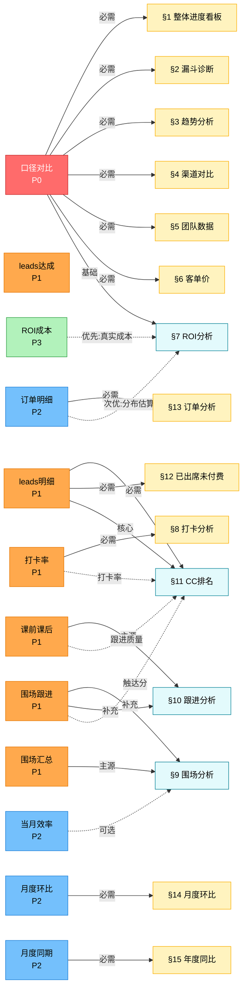

# 数据源依赖关系图

**文档版本**: v1.0
**生成日期**: 2026-02-20
**生成人**: mk-dependency-graph-sonnet

---

## 一、数据源加载器映射表

根据 `multi_source_loader.py` 和 `data_processor.py` 分析,系统共 12 个数据源:

| # | 数据源名称 | Loader 方法 | 数据文件路径 | 消费分析维度 | 优先级 |
|---|-----------|------------|-------------|-------------|--------|
| 1 | 口径对比 | `DataProcessor.process()` | `input/*.xlsx`（主数据） | §1-§6 | P0 |
| 2 | leads达成 | `_load_leads_achievement()` | `input/转介绍leads达成/*.xlsx` | §7, §11 | P1 |
| 3 | 打卡率 | `_load_checkin_rate()` | `input/当月转介绍打卡率/*.xlsx` | §8, §11 | P1 |
| 4 | 围场汇总 | `_load_cohort_summary()` | `input/围场汇总/*.xlsx` | §9 | P1 |
| 5 | 当月效率 | `_load_channel_cohort_efficiency()` | `input/当月效率/*.xlsx` | §9（补充） | P2 |
| 6 | 课前课后 | `_load_trial_followup()` | `input/课前课后/*.xlsx` | §10, §11 | P1 |
| 7 | 围场跟进 | `_load_cohort_outreach()` | `input/围场跟进/*.xlsx` | §9, §10, §11 | P1 |
| 8 | leads明细 | `_load_leads_detail()` | `input/leads明细/*.xlsx` | §11, §12 | P1 |
| 9 | 订单明细 | `_load_order_detail()` | `input/订单明细/*.xlsx` | §7（ROI增强）, §13 | P2 |
| 10 | 月度环比 | `_load_mom_comparison()` | `input/月度环比/*.xlsx` | §14 | P2 |
| 11 | 月度同期 | `_load_yoy_comparison()` | `input/月度同期/*.xlsx` | §15 | P2 |
| 12 | ROI成本 | `ROILoader.load_roi_costs()` | `input/ROI成本/*.xlsx` | §7（ROI真实成本） | P3 |

---

## 二、分析维度消费依赖表

基于 `analysis_engine.py` 的 `analyze()` 方法和各 `_analyze_*` 方法:

| 分析维度 | 主数据源 | 次级数据源 | 是否可降级 | 降级方案 | 备注 |
|---------|---------|-----------|----------|---------|------|
| **§1** 整体进度看板 | 口径对比 | - | ❌ 否 | - | 单点依赖,无降级 |
| **§2** 漏斗诊断 | 口径对比 | - | ❌ 否 | - | 单点依赖,无降级 |
| **§3** 趋势分析 | 口径对比 | - | ❌ 否 | - | 单点依赖,无降级 |
| **§4** 渠道对比 | 口径对比 | - | ❌ 否 | - | 单点依赖,无降级 |
| **§5** 团队数据 | 口径对比 | - | ❌ 否 | - | 单点依赖,无降级 |
| **§6** 客单价 | 口径对比 | - | ❌ 否 | - | 单点依赖,无降级 |
| **§7** ROI分析 | 口径对比 | ROI成本,订单明细 | ✅ 是 | 3级降级:①真实成本 ②订单明细分布估算 ③50/50假设 | 已实现降级逻辑 |
| **§8** 打卡分析 | 打卡率 | - | ⚠️ 部分 | 报告章节为空 | 无汇总数据,但不影响整体 |
| **§9** 围场分析 | 围场汇总,围场跟进 | 当月效率 | ⚠️ 部分 | 围场汇总单源可生成基础分析 | 跟进数据缺失会影响触达率 |
| **§10** 跟进分析 | 课前课后,围场跟进 | - | ⚠️ 部分 | 课前课后单源可生成部分分析 | 缺失围场跟进会影响完整性 |
| **§11** CC排名 | leads明细,课前课后,打卡率,围场跟进 | - | ❌ 否 | leads明细缺失则整章节为空 | 4源聚合,leads明细为单点 |
| **§12** 已出席未付费 | leads明细 | - | ⚠️ 部分 | 章节为空,不影响其他分析 | 单点依赖但非核心 |
| **§13** 订单分析 | 订单明细 | - | ⚠️ 部分 | 章节为空,不影响其他分析 | 单点依赖但非核心 |
| **§14** 月度环比 | 月度环比 | - | ⚠️ 部分 | 章节为空,不影响其他分析 | 单点依赖但非核心 |
| **§15** 年度同比 | 月度同期 | - | ⚠️ 部分 | 章节为空,不影响其他分析 | 单点依赖但非核心 |
| **§16** 归因分析 | 口径对比（历史） | - | ⚠️ 部分 | 需>=6个月数据,否则章节为空 | 依赖历史数据累积 |

**图例说明**:
- ✅ 可降级: 有备用数据源或预估逻辑
- ⚠️ 部分降级: 缺失后章节为空,但不影响报告整体生成
- ❌ 不可降级: 缺失后报告核心受损或无法生成

---

## 三、数据源依赖关系 DAG 图



---

## 四、单点依赖风险清单

根据降级能力分析,以下数据源存在单点依赖风险:

| # | 数据源 | 影响范围 | 风险等级 | 缺失影响 | 建议 |
|---|-------|---------|---------|---------|------|
| 1 | **口径对比** | §1-§6（核心看板） | 🔴 高 | 报告无法生成,系统彻底失效 | ① 建立每日自动备份 ② T-1日数据未到时使用T-2降级 ③ 监控数据源更新时间 |
| 2 | **leads明细** | §11 CC排名,§12 已出席未付费 | 🟡 中 | CC个人级分析缺失,但团队级分析（§5）仍可用 | ① 从CRM建立导出定时任务 ② 可降级使用团队级数据（leads达成） |
| 3 | **打卡率** | §8 打卡分析,§11 CC排名（打卡维度） | 🟢 低 | 打卡章节为空,CC排名缺少打卡维度（权重15%） | ① 可降级,CC排名其他维度（85%）仍可用 ② 长期从运营系统建立自动导出 |
| 4 | **订单明细** | §13 订单分析,§7 ROI（分布估算） | 🟢 低 | 订单章节为空,ROI降级到分位数估算 | ① ROI已有3级降级逻辑 ② 从财务系统建立每日订单同步 |
| 5 | **月度环比** | §14 月度环比趋势 | 🟢 低 | 环比章节为空,但§3趋势分析可用口径对比历史数据替代 | ① 从BI系统建立自动导出 ② 可用口径对比历史月度数据临时替代 |
| 6 | **月度同期** | §15 年度同比趋势 | 🟢 低 | 同比章节为空,影响有限 | ① 从BI系统建立自动导出 ② 非核心分析,缺失可接受 |

**风险等级定义**:
- 🔴 高: 缺失后报告核心受损或无法生成
- 🟡 中: 缺失后部分关键分析无法执行,但有团队级降级
- 🟢 低: 缺失后章节为空,但不影响报告整体价值

---

## 五、数据源优先级建议（基于依赖分析）

结合任务 #1 的调研结果和本依赖分析,优先级建议:

### P0（核心必需,24小时SLA）
- **口径对比**: 影响 §1-§6 核心看板,单点依赖,无降级方案
- **缺失应对**: T-1数据未到时自动回退T-2,并发送预警通知

### P1（关键分析,48小时SLA）
- **leads达成**: 影响 §7 团队级leads对标
- **打卡率**: 影响 §8 打卡分析 + §11 CC排名（15%权重）
- **围场汇总**: 影响 §9 围场分析主体
- **课前课后**: 影响 §10 跟进分析主体 + §11 CC排名（25%权重）
- **围场跟进**: 影响 §9/§10 触达率补充 + §11 CC排名（15%权重）
- **leads明细**: 影响 §11 CC排名（30%核心） + §12 已出席未付费
- **缺失应对**: 相关章节显示"数据待更新",报告其他部分正常生成

### P2（增强分析,1周SLA）
- **当月效率**: §9 围场分析的次级补充
- **订单明细**: §13 订单分析 + §7 ROI分布优化（已有降级）
- **月度环比**: §14 环比趋势（可用口径对比历史数据替代）
- **月度同期**: §15 同比趋势（非核心）
- **缺失应对**: 章节为空或使用降级逻辑

### P3（优化增强,按需更新）
- **ROI成本**: §7 ROI真实成本（已有3级降级:订单明细估算→分位数估算→50/50假设）
- **缺失应对**: 自动降级到预估模式,标注数据可信度🟡

---

## 六、数据源接入健康度检查清单

基于依赖分析,建议数据源注册表增强以下字段:

```json
{
  "数据源名称": "口径对比",
  "优先级": "P0",
  "SLA": "T-1日 23:59",
  "依赖维度": ["§1", "§2", "§3", "§4", "§5", "§6"],
  "单点依赖": true,
  "降级方案": "无,使用T-2历史数据",
  "缺失影响": "报告无法生成",
  "监控阈值": {
    "数据新鲜度": "< 48小时",
    "文件大小": "> 10KB",
    "行数": "> 10行"
  },
  "自动化等级": "手工上传",
  "改进建议": "建立每日自动备份,T-1未到时回退T-2"
}
```

---

## 七、依赖关系洞察

1. **核心单点**: 口径对比是唯一P0数据源,影响6个核心分析维度（§1-§6），必须建立备份机制
2. **聚合热点**: §11 CC排名依赖4个数据源（leads明细30%+课前课后25%+打卡率15%+围场跟进15%），其中leads明细为核心单点
3. **降级典范**: §7 ROI已实现3级降级（真实成本→订单明细分布估算→分位数估算→50/50假设），可作为其他分析的降级设计参考
4. **P1集群**: 7个P1数据源中,6个影响§9-§12的多维分析,建议建立P1数据源集体健康度监控面板
5. **历史依赖**: §16 归因分析需要≥6个月的口径对比历史数据,M8历史数据累积系统已部分解决,但需持续监控历史快照完整性

---

**下一步**: 将本依赖关系映射集成到数据源注册表（任务 #4）,并建立自动化健康度检查（任务 #5）

**生成时间**: 2026-02-20 14:32
**数据来源**: `src/data_processor.py`, `src/analysis_engine.py`, `src/multi_source_loader.py`, `src/roi_loader.py`
