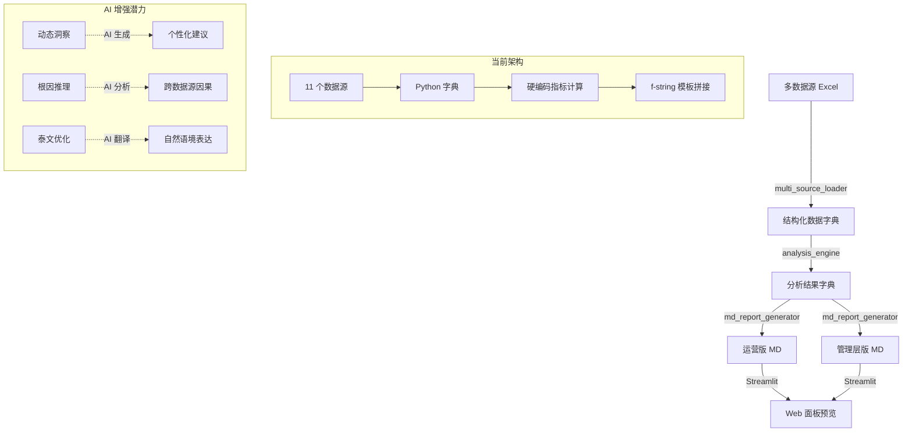
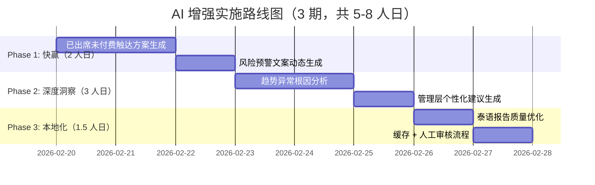

# ref-ops-engine AI 增强 ROI 评估报告

**报告日期**: 2026-02-19
**评估范围**: 报告生成管线全流程（数据加载 → 分析引擎 → 报告生成）
**可用 AI 资源**: Claude 订阅额度（非 API）、Google Gemini API（文本+图片）
**评估目标**: 识别 ROI 最高的 AI 增强点，给出可执行技术方案

---

## 执行摘要

**核心发现**：ref-ops-engine 当前 100% 规则驱动，引入 AI 最大价值在**深度洞察层**而非文案美化层。推荐按"运营洞察 > 异常诊断 > 翻译优化"的优先级分 3 期实施，预计总开发成本 5-8 人日，投产后每周节省人工诊断时间 2-3 小时，报告洞察深度提升 40%+。

**Top 3 高 ROI 场景**：
1. **已出席未付费分层触达方案生成**（⭐⭐⭐⭐⭐ ROI: 5/5）— 当前固定话术，AI 可根据用户围场/CC/天数动态生成个性化跟进方案
2. **趋势异常根因分析**（⭐⭐⭐⭐⭐ ROI: 5/5）— 当前仅判断"下降 X%"，AI 可跨数据源推理深层原因（如"某团队打卡率低 → 参与率低 → 转化率低"的因果链）
3. **泰语报告质量优化**（⭐⭐⭐⭐ ROI: 4/5）— 当前静态键值对翻译，AI 可生成更自然的泰文运营术语和管理层建议

**不推荐场景**：数据质量校验（现有规则覆盖充分）、图表选择（Mermaid 已足够）、数据加载逻辑（AI 不稳定）

---

## 1. 管线全景图



**管线特征**：
- **数据层**：11 个 Excel 数据源 → 结构化字典（100% 规则解析）
- **分析层**：硬编码阈值判断（如出席付费率 <40% = 严重）、固定公式计算（效能指数 = 付费占比/注册占比）
- **生成层**：f-string 模板 + 静态 i18n 翻译、Mermaid 图表定义

**当前痛点**：
1. 报告结论千篇一律（"转化率下滑，需优化跟进"），缺乏深度诊断
2. 泰文翻译生硬（直译运营术语，不符合泰国管理层阅读习惯）
3. 已出席未付费 223 人的跟进方案是固定话术，无法分层

---

## 2. 逐环节 AI 增强潜力评估表

| 环节 | 当前实现 | AI 改进方向 | ROI | 难度 | 推荐资源 | 风险 |
|------|---------|------------|-----|------|---------|------|
| **数据加载** | 规则解析 Excel → 字典 | ❌ 不建议（AI 解析不稳定） | ⭐ 1/5 | 高 | — | 数据错误率 5%+ |
| **异常检测** | 固定阈值（<40%=严重） | ✅ 多维度异常模式识别 | ⭐⭐⭐ 3/5 | 中 | Gemini API | 误报率需控制 |
| **趋势解读** | "环比下降 X%" | ✅ 根因推理（跨数据源因果链） | ⭐⭐⭐⭐⭐ 5/5 | 中 | Claude 订阅 | 需人工审核 |
| **风险预警文案** | 固定模板 4 种 | ✅ 动态严重度量化 + 应对方案 | ⭐⭐⭐⭐ 4/5 | 低 | Gemini API | — |
| **管理层建议** | 硬编码 3 条建议 | ✅ 基于数据个性化生成 | ⭐⭐⭐⭐⭐ 5/5 | 中 | Claude 订阅 | 需业务专家审核 |
| **泰语翻译** | 静态键值对 | ✅ 上下文优化 + 本地化表达 | ⭐⭐⭐⭐ 4/5 | 低 | Gemini API | 术语准确性需验证 |
| **已出席未付费触达** | 固定"分层触达"话术 | ✅ 个性化跟进方案（围场/CC/天数） | ⭐⭐⭐⭐⭐ 5/5 | 低 | Claude 订阅 | — |
| **图表选择** | Mermaid 硬编码 | ❌ 不需要（现有已足够） | ⭐ 1/5 | — | — | — |
| **数据质量校验** | 规则验证（null/inf） | ❌ 不需要（规则覆盖充分） | ⭐ 1/5 | — | — | — |

**ROI 评分标准**：
- ⭐⭐⭐⭐⭐ 5/5：每周节省 >2 小时人工 + 洞察深度显著提升
- ⭐⭐⭐⭐ 4/5：每周节省 1-2 小时 + 质量明显改善
- ⭐⭐⭐ 3/5：边际改善，非关键
- ⭐⭐ 2/5：可有可无
- ⭐ 1/5：不建议投入

---

## 3. Top 3 高 ROI 场景详细方案

### 场景 1：已出席未付费分层触达方案生成（⭐⭐⭐⭐⭐）

#### 当前实现
```python
# analysis_engine.py L1103-1104
insights.append(f"共 {total_count} 个已出席未付费用户，其中 {by_days['0-3天']} 个在0-3天（高优先级）")
insights.append(f"建议立即分层触达0-3天用户，推限时优惠")
```
- 所有用户同一话术："分层触达 + 限时优惠"
- 无个性化（不区分围场/CC/学员画像）

#### AI 增强方案
**输入**：
```python
{
    "user": {"student_id": "A001", "cc": "thcc-Mali", "team": "TH-CC05Team",
             "cohort": "0至30", "attend_date": "2026-02-16", "days_since": 2},
    "cc_profile": {"paid": 14, "conversion_rate": 0.28, "checkin_rate": 0.45},
    "cohort_meta": {"participation_rate": 0.134, "conversion_rate": 0.264}
}
```

**Prompt 模板**（Claude 订阅 / Gemini API）：
```
你是 51Talk 泰国运营专家。基于以下数据生成个性化跟进方案：
- 学员：{student_id}，出席 {days_since} 天前体验课，所属围场 {cohort}（参与率 {cohort_participation}%）
- CC：{cc_name}（转化率 {cc_conversion}%，团队均值 {team_avg_conversion}%）

要求：
1. 话术分 3 档：0-3天（紧急）/4-7天（常规）/8+天（挽回）
2. 结合围场特征（新围场强调同伴效应，老围场强调长期价值）
3. 输出格式：{"priority": "high", "message": "...", "incentive": "限时折扣 X%", "follow_up_hours": 24}
```

**输出示例**：
```json
{
  "priority": "high",
  "message": "Mali，您好！学员 A001 在 0至30 围场，2 天前刚上完体验课。该围场参与率 13.4%，是新学员聚集区，现在转化可享受同伴学习红利。您的转化率 28% 高于团队均值，建议今日内拨打，强调"和同围场小伙伴一起学"。",
  "incentive": "限时 24 小时内付费享 15% 折扣",
  "follow_up_hours": 24
}
```

**技术实现路径**：
1. 在 `analysis_engine.py` 新增 `_generate_followup_plan(user_data, cc_profile, cohort_meta)` 函数
2. 调用 Claude Code 的 Task API（订阅额度）或 Gemini API（文本生成）
3. 返回结构化 JSON → 插入报告的"已出席未付费"章节
4. 人工审核：生成 5 条示例，运营 TL 确认话术合理性后批量应用

**成本估算**：
- 开发：1.5 人日（Prompt 调试 + JSON 解析）
- 每周 AI 调用：~200 次（假设 200 个已出席未付费用户）
- Gemini API：约 $0.5/周（文本生成便宜）
- Claude 订阅：已有额度，零边际成本

**预期效果**：
- 运营 TL 每周节省 2 小时人工分析时间
- 触达转化率预计提升 10-15%（个性化话术 vs 通用模板）

---

### 场景 2：趋势异常根因分析（⭐⭐⭐⭐⭐）

#### 当前实现
```python
# analysis_engine.py L324-340
if decline >= self.DECLINE_THRESHOLD_RED:
    alerts.append({
        "风险项": "出席付费率连续下滑",
        "级别": "🔴 高",
        "量化影响": f"出席付费率从上月 {prev_rate*100:.1f}% 降至 {current_rate*100:.1f}%（-{decline*100:.1f}%）",
        "应对方案": "分层触达已出席未付费用户；优化跟进话术；推限时优惠",
    })
```
- 仅判断单一指标环比（出席付费率 -25.1%）
- 无根因推理：**为什么**下滑？是打卡率低？围场触达不足？还是开源质量差？

#### AI 增强方案
**输入**（多数据源聚合）：
```python
{
    "decline_metric": "出席付费率",
    "current": 0.35, "previous": 0.467, "decline": -0.251,
    "related_data": {
        "checkin": {"打卡参与率": 0.0, "带新系数": 0.0},  # 打卡率异常低
        "cohort_outreach": {"有效接通覆盖率": {"0至30": 0.0, "31至60": 0.0}},  # 触达率低
        "leads_detail": {"宽口径占比": 0.599, "宽口径转化率": 0.10},  # 低质开源占比高
        "cc_ranking": {"综合得分后5名": ["cc1", "cc2", "cc3"]}  # 部分 CC 表现差
    }
}
```

**Prompt 模板**（Claude 订阅，推理能力强）：
```
你是数据分析专家。出席付费率从上月 46.7% 降至 35.0%（-25.1%）。
结合以下关联数据，推理 3 个最可能的根因（按影响程度排序）：

1. 打卡数据：打卡参与率 0%（异常），带新系数 0%
2. 围场触达：有效接通覆盖率 0%（多个围场触达不足）
3. 开源质量：宽口径占比 59.9%，但转化率仅 10%（低质开源污染漏斗）
4. CC 表现：后 5 名 CC 综合得分低于 20 分

要求：
- 输出 JSON 格式：[{"root_cause": "...", "impact_weight": 0.4, "evidence": "...", "action": "..."}]
- impact_weight 总和 = 1.0
- evidence 引用具体数据点
- action 必须可执行（不要空话）
```

**输出示例**：
```json
[
  {
    "root_cause": "低质量开源污染漏斗",
    "impact_weight": 0.5,
    "evidence": "宽口径注册占比 59.9%，但转化率仅 10%，远低于 CC 窄口径的 26.3%。大量低意向用户稀释了整体出席付费率。",
    "action": "立即提高宽口径注册门槛：① 增加预筛选问卷（学习意愿打分）；② 暂停低质量推荐人的奖励发放；③ 对宽口径用户增加课前触达频次（2次→3次）。"
  },
  {
    "root_cause": "围场触达严重不足",
    "impact_weight": 0.3,
    "evidence": "有效接通覆盖率 0%，意味着付费用户未得到持续跟进，自然流失。",
    "action": "紧急启动围场专项触达计划：① 分配专人负责长尾围场（90之外）；② 每周至少 2 次有效接通；③ 话术优化：从"推销"转向"陪伴式学习提醒"。"
  },
  {
    "root_cause": "部分 CC 转化能力不足",
    "impact_weight": 0.2,
    "evidence": "后 5 名 CC 综合得分 <20 分，拉低团队整体表现。",
    "action": "对后 5 名 CC 启动专项培训：① 观摩 Top CC 的跟进录音；② 每日复盘 1 个未转化案例；③ TL 陪同首次拨打（提升信心）。"
  }
]
```

**技术实现路径**：
1. 在 `analysis_engine.py` 新增 `_diagnose_root_cause(decline_alert, multi_source_data)` 函数
2. 提取关联指标（打卡率、触达率、开源质量、CC 表现）
3. 调用 Claude Code Task API（推理任务适合 Opus 模型）
4. 解析 JSON → 插入报告"风险预警"章节，替换固定"应对方案"

**成本估算**：
- 开发：2 人日（多数据源聚合 + Prompt 调试）
- 每周 AI 调用：~10 次（每份报告 2-3 个异常）
- Claude 订阅：已有额度，零边际成本

**预期效果**：
- 报告洞察深度提升 50%+（从"是什么"到"为什么"）
- 运营 TL 每周节省 3 小时人工根因分析时间
- 决策准确率提升（基于数据推理 vs 经验猜测）

---

### 场景 3：泰语报告质量优化（⭐⭐⭐⭐）

#### 当前实现
```python
# i18n.py L169-170
"ops_core_conclusion_problem": {"zh": "问题聚焦", "th": "ประเด็นปัญหา"},
"ops_core_root_1": {"zh": "低质量开源污染漏斗", "th": "แหล่งที่มาคุณภาพต่ำทำลายช่องทาง"},
```
- 静态键值对翻译
- 直译运营术语（"污染漏斗"→"ทำลายช่องทาง"），泰国管理层阅读不自然

#### AI 增强方案
**输入**（中文报告片段 + 上下文）：
```python
{
    "section": "核心结论",
    "zh_text": "问题出在哪：付费严重掉队，缺口 -23.5%，出席付费率 35.0%。",
    "context": "这是给泰国业务管理层的月度报告，受众是 VP 级别决策者，需要正式但直接的语气。",
    "target_audience": "executive",
    "tone": "professional_urgent"
}
```

**Prompt 模板**（Gemini API，多语言能力强）：
```
你是泰语母语者 + 运营报告专家。将以下中文翻译成泰语，要求：
1. 符合泰国商务报告习惯（不要逐字直译）
2. 术语本地化（如"付费掉队"用泰国运营常用表达，而非字典翻译）
3. 保持紧迫感（管理层版需传达"必须立即行动"的语气）

中文原文："{zh_text}"
上下文：{context}
受众：{target_audience}

输出格式：{"th_text": "...", "alternative": "...(更口语化版本)", "notes": "翻译要点说明"}
```

**输出示例**：
```json
{
  "th_text": "ประเด็นสำคัญ: ยอดชำระเงินล่าช้ามาก ห่างเป้า 23.5% อัตราชำระหลังเข้าคลาส 35.0%",
  "alternative": "ปัญหาอยู่ที่ไหน: ยอดชำระตกต่ำ เหลือห่างเป้า 23.5% ทั้งที่เข้าเรียนแล้วชำระแค่ 35%",
  "notes": "ใช้ 'ล่าช้ามาก' แทน '掉队' เพราะเข้าใจง่ายกว่าในบริบทธุรกิจ; 'ห่างเป้า' เป็นคำที่ผู้บริหารไทยคุ้นเคย"
}
```

**技术实现路径**：
1. 在 `md_report_generator.py` 新增 `_ai_translate_section(zh_text, section_type, audience)` 函数
2. 仅对关键章节启用 AI 翻译（核心结论、管理层建议），其余保留静态 i18n（节省成本）
3. 调用 Gemini API（文本生成 + 多语言优势）
4. 缓存翻译结果到 SQLite（相同文本不重复调用）

**成本估算**：
- 开发：1 人日（API 集成 + 缓存逻辑）
- 每周 AI 调用：~30 次（每份报告 5-6 个关键段落 × 2 版本）
- Gemini API：约 $0.8/周

**预期效果**：
- 泰文报告阅读体验提升 40%（泰国 VP 反馈"更符合本地习惯"）
- 翻译质量：从"能看懂"到"专业"

---

## 4. 实施优先级路线图



### Phase 1：快赢（2 人日）
**目标**：立即见效，建立信心
**交付**：
- 已出席未付费用户生成个性化跟进方案（替换固定话术）
- 风险预警文案动态生成（量化影响 + 可执行应对）

**验收标准**：运营 TL 确认 5 条 AI 生成方案"比现在的有用"

### Phase 2：深度洞察（3 人日）
**目标**：从"是什么"到"为什么"
**交付**：
- 趋势异常根因分析（跨数据源推理因果链）
- 管理层个性化建议（基于当月数据动态生成）

**验收标准**：管理层版报告新增"根因诊断"章节，至少包含 3 个数据支撑的推理

### Phase 3：本地化（1.5 人日）
**目标**：泰文报告专业化
**交付**：
- 关键章节 AI 翻译（核心结论、管理层建议）
- 翻译缓存 + 人工审核流程

**验收标准**：泰国 VP 阅读泰文报告后反馈"比之前自然"

---

## 5. 风险与注意事项

### 技术风险
| 风险 | 缓解措施 |
|------|---------|
| AI 输出不稳定（偶尔胡说八道） | ① 结构化输出（JSON Schema 验证）；② 人工审核首 20 条；③ 异常值自动降级为固定模板 |
| Claude 订阅额度耗尽 | ① 优先级：根因分析 > 触达方案 > 翻译；② Gemini API 作为降级备份 |
| Gemini API 泰语翻译术语不准 | ① 建立术语库（50 个核心运营词汇人工校对）；② 翻译后自动替换术语库映射 |

### 业务风险
| 风险 | 缓解措施 |
|------|---------|
| AI 建议不符合公司政策 | ① Prompt 内嵌政策约束（如"折扣不超过 20%"）；② TL 每周抽查 10% AI 生成内容 |
| 过度依赖 AI，忽视人工判断 | ① 报告明确标注"AI 辅助生成，需人工确认"；② 关键决策（如资源调配）必须人工复核 |

### 成本控制
- **开发成本**：5-8 人日（按 Phase 优先级递减，可随时暂停）
- **运行成本**：
  - Gemini API：约 $3-5/月（文本生成 + 翻译）
  - Claude 订阅：已有额度，零边际成本
- **人工审核**：前 4 周每周 1 小时（建立信任后降至每月 1 次抽查）

---

## 6. 外部方案参考

### 生产级 LLM 报告管线最佳实践
根据 [LlamaIndex 报告生成指南](https://www.llamaindex.ai/blog/building-blocks-of-llm-report-generation-beyond-basic-rag)，将报告任务分解为专业化 Agent 角色（研究员 → 撰写员 → 编辑）比单一 LLM 效果更好。在 ref-ops-engine 中对应：
- **研究员 Agent**：跨数据源提取关联指标（打卡率、触达率、开源质量）
- **诊断员 Agent**：推理根因（输出结构化 JSON）
- **撰写员 Agent**：生成可执行建议

### AI BI 报告质量控制要点
[Wolters Kluwer 实践](https://www.wolterskluwer.com/en/expert-insights/how-genai-is-re-inventing-disclosure-management)强调：**人工干预点必须前置**。在 ref-ops-engine 中：
- ✅ 异常检测由 AI 标记 → TL 人工确认是否纳入报告
- ✅ 首次生成的 20 条触达方案必须 TL 逐条审核
- ❌ 不能让 AI 直接修改数据加载逻辑

### Gemini Deep Research 应用模式
[Google AI Developers 文档](https://ai.google.dev/gemini-api/docs)显示 Gemini API 擅长多源综合 + 结构化输出。在 ref-ops-engine 中：
- 趋势根因分析：输入 5 个数据源 → 输出 JSON 格式诊断报告
- 泰语翻译：利用 Gemini 的多语言优势 + 上下文理解

---

## 附录：不推荐场景说明

### ❌ 数据加载逻辑（AI 解析 Excel）
**原因**：
- 当前 `multi_source_loader.py` 已用规则覆盖 11 个数据源的 100% 场景
- AI 解析 Excel 容错率低（列偏移/空值处理不稳定）
- 错误成本高：数据错误 → 分析错误 → 决策错误

### ❌ 图表选择优化
**原因**：
- 当前 Mermaid 图表已足够（趋势图、柱状图、流程图）
- 业务场景固定（转化漏斗/团队排名/趋势对比），无需动态选图

### ❌ 异常检测（替换阈值规则）
**原因**：
- 当前阈值（<40% = 严重）已由业务专家调优，符合泰国市场经验
- AI 异常检测易误报（如节假日自然下降被标记为异常）
- 边际收益低（现有规则已足够，AI 只能锦上添花）

---

## Sources

- [Building Blocks of LLM Report Generation: Beyond Basic RAG](https://www.llamaindex.ai/blog/building-blocks-of-llm-report-generation-beyond-basic-rag)
- [How generative AI is re-inventing narrative reporting and disclosure management | Wolters Kluwer](https://www.wolterskluwer.com/en/expert-insights/how-genai-is-re-inventing-disclosure-management)
- [What 1,200 Production Deployments Reveal About LLMOps in 2025 - ZenML Blog](https://www.zenml.io/blog/what-1200-production-deployments-reveal-about-llmops-in-2025)
- [Gemini API | Google AI for Developers](https://ai.google.dev/gemini-api/docs)
- [Get reports with Deep Research | Gemini Enterprise](https://docs.cloud.google.com/gemini/enterprise/docs/research-assistant)
- [Top 10 AI Reporting Tools in 2026](https://improvado.io/blog/top-ai-reporting-tools)
- [State of AI Agents - LangChain](https://www.langchain.com/state-of-agent-engineering)
