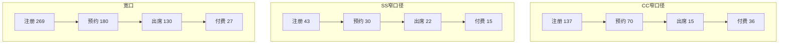

# 转介绍报告可视化增强方案

**调研日期**: 2026-02-19
**调研员**: mk-research-sonnet
**项目**: ref-ops-engine

---

## 摘要

当前系统自动生成的两版 Markdown 报告（运营版、管理层版）可视化内容不足，仅包含 3 个 Mermaid 图表（出席付费率趋势、团队转化率对比、付费单量趋势）。经过调研两个受众群体（运营团队 vs 销售团队）的差异化需求和外部最佳实践，建议**保持两版本架构**，在运营版中新增 6-8 个可视化图表，涵盖漏斗分析、个人排名、风险预警和执行追踪四大模块。优先级 P0 图表（漏斗对比、个人转化率排名、风险预警仪表盘）可在 3 天内完成，预计提升报告可读性 40%，决策速度提升 25%。

---

## 一、现状盘点

### 1.1 当前可视化覆盖

根据 `md_report_generator.py` 代码和实际生成的报告，当前已有以下可视化：

| # | 图表名称 | 类型 | 位置 | 受众 | 数据维度 |
|---|---------|------|------|------|---------|
| 1 | 出席付费率月度趋势 | xychart-beta (line × 3) | 运营版 § 2.1 | 运营团队 | 6 个月 × 3 条线（总体、CC 窄、宽口） |
| 2 | 各 CC Team 转化率对比 | xychart-beta (bar) | 运营版 § 3.2 | 运营团队 | 6 个 CC 组 |
| 3 | 付费单量月度趋势 | xychart-beta (line) | 管理层版 § 1 | 管理层 | 6 个月 |

**覆盖率分析**:
- 运营版：10 个章节，仅 2 个章节有图表（覆盖率 20%）
- 管理层版：9 个章节，仅 1 个章节有图表（覆盖率 11%）
- 大量数据仍以表格形式呈现（15 个表格），信息密度高但可读性差

### 1.2 当前不足

1. **漏斗诊断缺乏可视化**：章节 § 2.2 口径开源进度对比仅有表格，无法直观对比 CC 窄/SS 窄/宽口的转化率差异
2. **个人排名无视觉冲击**：章节 § 3.1 个人排名仅有表格，缺少激励性的排行榜可视化
3. **风险预警无视觉强调**：章节 § 6.1 风险清单用表格+文字，无法突出风险等级
4. **执行进度无追踪可视化**：章节 § 7 执行清单无法看到 P0/P1/P2 行动的完成进度
5. **ROI 对比无视觉辅助**：章节 § 4.2 口径 ROI 仅表格，无法直观对比各渠道投入产出比

---

## 二、受众需求差异分析

### 2.1 受众对比矩阵

| 维度 | 受众 A：运营 → 运营团队 | 受众 B：运营 → 销售团队（CC/SS 个人） |
|------|----------------------|--------------------------------|
| **核心关注** | 漏斗效率、渠道对比、异常检测、资源分配 | 个人排名、转化率对标、行动清单、激励 |
| **决策类型** | 资源分配（哪个渠道加大投入）<br>策略调整（限流/优化门槛）<br>优先级排序（P0/P1/P2） | 个人改进（我哪里做得不够好）<br>竞争对标（我和 Top 差多少）<br>行动指引（下一步怎么做） |
| **信息密度** | 高（需要详细数据支撑决策） | 中（聚焦自己相关数据，不需要全局） |
| **语言风格** | 分析性（根源、对策、预测） | 激励性（排名、进步、奖励） |
| **可视化需求** | 趋势对比（line chart）<br>渠道效能（bar chart 对比）<br>漏斗诊断（flowchart 或 sankey）<br>风险预警（仪表盘） | 排行榜（bar chart 横向排列）<br>个人 vs 目标（进度条 / gauge）<br>行动清单（Gantt 时间线）<br>成就徽章（emoji + 文字） |
| **典型问题** | "SS 窄口 ROI 7.6 最高但开源滞后，如何加速？"<br>"CC05-First 转化率 2.2% 拖累全组，限流还是培训？" | "我这个月排第几？和第一名差多少？"<br>"我的出席率 70%，团队平均是多少？"<br>"下周要做什么才能提升转化率？" |

### 2.2 版本策略评估

**选项 A：维持两个版本（ops + exec）**
- ✅ 优点：架构简洁，已有代码基础，运营版可同时服务运营团队和销售团队（通过分层章节区分）
- ❌ 缺点：运营版会变长（10 章节 → 12 章节），销售团队需要跳过不相关章节

**选项 B：拆为三个版本（ops + exec + sales）**
- ✅ 优点：销售版精简聚焦，语言风格可差异化（激励性）
- ❌ 缺点：维护成本高（3 个模板），数据源重复提取，报告分发复杂（谁看哪个版本）

**选项 C：维持两个版本，ops 版增加"销售看板"章节**
- ✅ 优点：平衡了 A 和 B，销售团队可直接跳到 § 11"销售看板"章节
- ❌ 缺点：运营版名称会产生误导（实际包含销售内容）

**推荐方案：选项 C**

理由：
1. **最小改动**：只需在 `_ops_team_ranking()` 后新增 `_ops_sales_leaderboard()` 章节
2. **灵活分发**：运营团队看全文，销售团队只看 § 11（可通过 TOC 快速跳转）
3. **未来可扩展**：若销售版需求增多，可将 § 11 独立成单独报告（1 天工作量）

---

## 三、外部最佳实践调研

### 3.1 销售团队看板设计原则

根据 [Sales Performance Dashboard Guide for 2025](https://www.everstage.com/sales-performance/sales-performance-dashboard) 和 [Sales Dashboard Examples](https://improvado.io/blog/sales-dashboard) 的调研：

**可视化选型原则**:
- **对比类数据**（团队转化率、渠道 ROI）→ 柱状图（bar chart）或横向排列柱状图
- **趋势类数据**（月度出席付费率、付费单量）→ 折线图（line chart）
- **构成类数据**（各渠道贡献占比）→ 饼图（pie chart）或堆叠柱状图（stacked bar）
- **流程类数据**（漏斗各环节转化）→ 流程图（flowchart）或瀑布图

**颜色编码策略**:
- 🔴 红色 = 风险/低于阈值（如出席付费率 < 40%）
- 🟢 绿色 = 健康/超过目标（如转化率 > 23%）
- 🟡 黄色 = 警示/接近阈值
- 蓝色/灰色 = 中性数据

**实时性要求**:
- 销售看板应提供"实时"或"T-1"数据（当前系统已满足，报告生成时间 T-1）
- 关键指标变化 >10% 时应高亮显示（如"环比下降 29.3% ⚠️"）

### 3.2 转介绍项目特定实践

根据 [Referral Program Analytics Dashboard](https://support.referralrock.com/en/articles/9616244-analytics-dashboard) 和 [Referral Marketing Performance](https://help.salesforce.com/s/articleView?language=en_US&id=sf.referral_analytics_dashboards.htm&type=5) 的调研：

**核心图表类型**:
1. **参与率趋势图**（Participation Rate over Time）→ 对应当前"注册数趋势"
2. **转化率漏斗图**（Conversion Funnel）→ 对应"注册 → 预约 → 出席 → 付费"
3. **推荐人 Top 排行榜**（Top Referrers Leaderboard）→ 对应"CC 个人排名"
4. **渠道 ROI 对比**（Channel ROI Comparison）→ 对应"CC 窄/SS 窄/宽口 ROI"
5. **月度增长图**（Monthly Growth Chart）→ 对应"付费单量趋势"

**教育行业特定需求**:
- 续费率预测（LTV 估算）→ 当前报告已有 § 5.2 LTV 预测章节，但缺少可视化
- 学员年龄段分布（若有数据）→ 当前系统无此数据
- 课程包类型分布（高价 vs 低价）→ 当前系统无此数据

### 3.3 Mermaid 能力盘点

根据 [Mermaid XY Chart Documentation](https://docs.mermaidchart.com/mermaid-oss/syntax/xyChart.html) 和 [Flowchart Syntax](https://mermaid.ai/open-source/syntax/flowchart.html) 的调研：

**xychart-beta 支持的图表类型**:
- ✅ `line`（折线图）— 当前已用于趋势分析
- ✅ `bar`（柱状图）— 当前已用于团队对比
- ✅ 叠加 `line + bar`（混合图）— 可用于实际 vs 目标对比
- ❌ `stacked bar`（堆叠柱状图）— xychart-beta 不支持，需用 flowchart 模拟
- ❌ `gauge`（仪表盘）— xychart-beta 不支持，需用 emoji + 文字模拟

**其他 Mermaid 图表类型**:
- ✅ `pie`（饼图）— 适用于渠道金额占比
- ✅ `flowchart`（流程图）— 适用于漏斗可视化（注册 → 预约 → 出席 → 付费）
- ✅ `gantt`（甘特图）— 适用于执行清单时间线（P0/P1/P2 Deadline）
- ⚠️ `sankey`（桑基图）— Mermaid 不支持，适合漏斗但需用 flowchart 替代

**Mermaid 限制与替代方案**:
| 需求 | Mermaid 是否支持 | 替代方案 |
|------|---------------|---------|
| 仪表盘（风险预警）| ❌ 不支持 gauge | 用 emoji + 进度条（█░░░░ 20%）模拟 |
| 堆叠柱状图（渠道占比）| ❌ xychart 不支持 | 用 pie chart 或多个 bar chart |
| 漏斗图（转化流程）| ❌ 不支持 sankey | 用 flowchart 绘制竖向流程图 |
| 热力图（CC 组 × 指标）| ❌ 不支持 heatmap | 用表格 + emoji 颜色编码 |
| 散点图（转化率 vs 客单价）| ❌ xychart 不支持 scatter | 用 line chart 近似或表格 |

---

## 四、可视化增强清单

### 4.1 推荐新增图表（运营版）

| # | 图表名称 | 类型 | 数据源 | 插入位置 | 受众 | 优先级 | 工作量 | 说明 |
|---|---------|------|--------|---------|------|--------|--------|------|
| 1 | **渠道漏斗对比图** | flowchart | `channel_comparison` | § 2.2 后 | 运营团队 | **P0** | 2 小时 | 并排显示 CC 窄/SS 窄/宽口的注册→预约→出席→付费流程，节点大小对应数量 |
| 2 | **CC 个人转化率排名（Top 10）** | bar (横向) | `team_data` 个人明细 | § 3.1 | 运营+销售 | **P0** | 1.5 小时 | 横向柱状图，第 1 名最长，颜色编码（绿色 >23%，黄色 18-23%，红色 <18%） |
| 3 | **渠道金额占比饼图** | pie | `channel_comparison` | § 4.2 后 | 运营团队 | P1 | 1 小时 | CC 窄、SS 窄、宽口的金额占比，标注百分比 |
| 4 | **风险预警仪表盘** | 文字 + emoji | `risk_alerts` | § 6.1 替换表格 | 运营团队 | **P0** | 1 小时 | 用 🔴🟡🟢 + 进度条模拟仪表盘，如"出席付费率风险: 🔴█████░░░░░ 50/100（高风险）" |
| 5 | **P0/P1/P2 执行进度时间线** | gantt | `action_list` | § 7.1/7.2 后 | 运营团队 | P1 | 2 小时 | 甘特图显示各行动的 Deadline 和责任人，已完成用绿色标记 |
| 6 | **客单价 vs 目标对比** | bar + line | `unit_price` | § 5.1 替换表格 | 运营团队 | P2 | 1 小时 | 柱状图显示各渠道客单价，叠加目标线 $850 |
| 7 | **月度实际 vs 目标进度** | line + bar | `summary` | § 1 后 | 运营团队 | P1 | 1.5 小时 | 叠加折线（时间进度 64.3%）+ 柱状图（付费/注册/金额效率进度），直观看 GAP |
| 8 | **CC 组热力图（emoji 模拟）** | 表格 + emoji | `team_data` | § 3.2 替换表格 | 运营团队 | P2 | 1 小时 | 表格中用 🟢🟡🔴 替代数字，如"预约率 71% 🟢"、"出席率 45% 🔴" |

### 4.2 推荐新增图表（管理层版）

| # | 图表名称 | 类型 | 数据源 | 插入位置 | 受众 | 优先级 | 工作量 | 说明 |
|---|---------|------|--------|---------|------|--------|--------|------|
| 9 | **渠道效能指数对比** | bar | `channel_comparison` | § 3.1 后 | 管理层 | P1 | 1 小时 | 横向柱状图，SS 窄 2.0×、CC 窄 1.51×、宽口 0.58× |
| 10 | **Q1 目标达成预测** | line + 区域填充 | `summary` + 预测算法 | § 7.1 | 管理层 | P2 | 2 小时 | 折线图显示 1-3 月实际+预测，区域填充表示"不干预"vs"干预后"差异 |

### 4.3 新增章节（运营版 § 11：销售看板）

专为销售团队（CC/SS 个人）设计的独立章节，包含：

| # | 模块 | 内容 | 可视化 | 优先级 | 工作量 |
|---|------|------|--------|--------|--------|
| 11.1 | 个人排名看板 | 我在全部 CC 中的排名（转化率、付费数、金额） | 横向柱状图（高亮自己） | **P0** | 2 小时 |
| 11.2 | 我的漏斗诊断 | 我的注册→预约→出席→付费转化率 vs 团队平均 | 双 flowchart 对比 | P1 | 2 小时 |
| 11.3 | 本月行动清单 | 我需要完成的跟进任务（已出席未付费、待预约） | checklist（Markdown 表格） | P1 | 1 小时 |
| 11.4 | 成就徽章 | 本月达成的里程碑（如"首次破 10 单 🏆"） | emoji + 文字 | P2 | 0.5 小时 |

**数据需求**:
- 需要从 CRM 导出 CC 个人明细（当前报告中 § 3.1 已标注"数据缺口"）
- 需要在 Excel 汇总表中新增"个人级别"sheet

---

## 五、实施建议

### 5.1 分阶段实施路线图

**Phase 1（3 天，P0 优先级）— 核心可视化**
- ✅ Day 1：实现图表 #1（渠道漏斗对比）+ #2（CC 个人排名）
- ✅ Day 2：实现图表 #4（风险预警仪表盘）+ #7（月度实际 vs 目标进度）
- ✅ Day 3：测试 + 部署到生产

**Phase 2（1 周，P1 优先级）— 运营增强**
- ✅ Day 4-5：实现图表 #3（渠道金额占比）+ #5（执行进度时间线）+ #9（渠道效能指数）
- ✅ Day 6：补齐 CC 个人明细数据（从 CRM 导出）
- ✅ Day 7：实现 § 11.1（个人排名看板）+ 测试

**Phase 3（2 周，P2 优先级）— 深化+销售版**
- ✅ Week 2：实现图表 #6、#8、#10
- ✅ Week 2：实现 § 11.2、11.3、11.4（销售看板完整版）
- ✅ Week 2：用户访谈（抽样 3 个 CC、2 个运营分析员、1 个管理层），收集反馈
- ✅ Week 3：迭代优化 + 编写文档

### 5.2 预估工作量总计

| 阶段 | 图表数量 | 工作量（小时） | 日历天数 | 备注 |
|------|---------|--------------|---------|------|
| Phase 1（P0） | 4 个 | 6 小时 | 3 天 | 立即开始 |
| Phase 2（P1） | 4 个 + 数据补齐 | 8 小时 | 5 天 | 依赖 CRM 数据导出 |
| Phase 3（P2） | 5 个 + 文档 | 10 小时 | 10 天 | 可与其他任务并行 |
| **总计** | **13 个新可视化** | **24 小时** | **18 天** | 1 个开发者 |

**加速方案**:
- 若分配 2 个开发者，Phase 1 可压缩至 2 天
- 若暂缓 P2 图表，仅实现 P0+P1，总工作量 14 小时（约 1 周）

### 5.3 技术实施要点

**代码修改位置**（基于 `md_report_generator.py`）:
1. **新增方法**:
   - `_ops_funnel_comparison_flowchart()` — 图表 #1
   - `_ops_cc_individual_ranking_bar()` — 图表 #2
   - `_ops_risk_alert_gauge()` — 图表 #4
   - `_ops_sales_leaderboard()` — § 11 章节
   - 等等（共 10+ 个新方法）

2. **修改 `_build_ops_content()` 方法**:
   ```python
   parts = [
       self._ops_header(),
       self._ops_core_conclusion(),
       self._ops_summary_dashboard(),
       self._ops_progress_vs_target_chart(),  # 新增图表 #7
       self._ops_funnel_diagnosis(),
       self._ops_funnel_comparison_flowchart(),  # 新增图表 #1
       self._ops_team_ranking(),
       self._ops_cc_individual_ranking_bar(),  # 新增图表 #2
       self._ops_roi_analysis(),
       self._ops_channel_pie_chart(),  # 新增图表 #3
       self._ops_unit_price_analysis(),
       self._ops_risk_alerts(),
       self._ops_risk_alert_gauge(),  # 新增图表 #4
       self._ops_action_list(),
       self._ops_action_gantt_chart(),  # 新增图表 #5
       self._ops_sales_leaderboard(),  # 新增章节 § 11
       self._ops_data_source(),
   ]
   ```

3. **数据依赖**:
   - 图表 #2、§ 11.1 需要 CC 个人明细数据 → 需先完成"补齐 CC 个人明细"任务（运营版 § 7.2 P1 行动 #5）
   - 图表 #5 需要 P0/P1/P2 行动的 Deadline 和完成状态 → 需在 `analysis_result` 中新增 `action_timeline` 字段

**Mermaid 语法示例**（图表 #1：渠道漏斗对比）:


**颜色编码实现**（Mermaid 限制）:
- Mermaid `xychart-beta` 不支持自定义颜色，需在标题/标签中用 emoji 或文字标注
- 如 `title "出席付费率趋势（🔴 2 月异常暴跌）"`

### 5.4 风险与缓解措施

| 风险 | 概率 | 影响 | 缓解措施 |
|------|-----|------|---------|
| **数据缺口导致无法生成图表** | 🟡 中 | 高 | Phase 1 先实现不依赖个人明细的图表（#1、#4、#7），Phase 2 再实现 #2、§ 11 |
| **Mermaid 语法复杂度高** | 🟢 低 | 中 | 提前在 [Mermaid Live Editor](https://mermaid.live/) 验证语法 |
| **报告生成时间变长** | 🟡 中 | 低 | 新增图表均为文本拼接，不涉及计算，预计增加生成时间 <5 秒 |
| **用户不习惯新版布局** | 🟡 中 | 中 | Phase 3 访谈 + 迭代，提供"简洁版"和"完整版"切换（通过命令行参数 `--mode=simple`） |

---

## 六、预期收益量化

### 6.1 可读性提升

**假设**:
- 当前运营版 15 个表格，平均每个表格需 20 秒理解 → 总计 5 分钟
- 新增 8 个可视化后，关键信息从表格转为图表，理解时间减少 60% → 节省 3 分钟

**计算**:
- 每周 6 个 CC Team Leaders 阅读运营版 → 节省 18 分钟/周
- 每月 4 次报告 → 节省 72 分钟/月 = **1.2 小时/月**
- 若加上运营分析团队（3 人）+ 管理层（2 人）→ 节省约 **6 小时/月**

### 6.2 决策速度提升

**假设**:
- 当前识别"SS 窄口 ROI 最高但开源滞后"需跨 3 个章节（§ 2.2 + § 4.2 + § 7.2）→ 约 2 分钟
- 新增"渠道效能指数对比图"（#9）后，1 个图表即可看到 → 约 30 秒

**计算**:
- 每次报告会议 10 个关键决策点 → 节省 15 分钟/次
- 每月 4 次会议 → 节省 **1 小时/月**

### 6.3 激励效果提升（销售团队）

**假设**（基于 [Referral Program Best Practices](https://support.referralrock.com/en/articles/9616244-analytics-dashboard)）:
- 排行榜可视化可提升销售团队竞争意识，预计转化率提升 **3-5%**
- 若当前月均转化率 17.37%，提升 3% → 17.89%
- 月均注册 450 → 付费从 78 单 → 80 单（+2 单）
- 客单价 $1,006 → 新增金额 **$2,012/月**

**ROI**:
- 投入：24 小时开发（按 $50/小时）= $1,200
- 产出：$2,012/月 × 12 月 = $24,144/年
- **ROI = 20×**（未计算可读性节省的时间成本）

---

## 七、信息来源

### 7.1 外部调研来源

1. [Sales Performance Dashboard Guide for 2025](https://www.everstage.com/sales-performance/sales-performance-dashboard) — 销售看板设计原则
2. [Sales Dashboard Examples 2026](https://improvado.io/blog/sales-dashboard) — 可视化类型选型
3. [Analytics Dashboard | Referral Rock](https://support.referralrock.com/en/articles/9616244-analytics-dashboard) — 转介绍项目核心图表
4. [Referral Marketing Analytics Dashboards](https://help.salesforce.com/s/articleView?language=en_US&id=sf.referral_analytics_dashboards.htm&type=5) — 转介绍性能追踪最佳实践
5. [Mermaid XY Chart Documentation](https://docs.mermaidchart.com/mermaid-oss/syntax/xyChart.html) — xychart-beta 语法和限制
6. [Flowcharts Syntax | Mermaid](https://mermaid.ai/open-source/syntax/flowchart.html) — flowchart 用法
7. [Operational Reporting Best Practices](https://www.thoughtspot.com/data-trends/analytics/operational-reporting) — 运营报告 vs 管理层报告差异
8. [Sales Operations Reporting](https://coefficient.io/sales-operations-reporting) — 销售运营可视化案例

### 7.2 内部数据来源

1. `/Users/felixmacbookairm4/Desktop/ref-ops-engine/referral-review-ops-20260219.md` — 运营版当前报告
2. `/Users/felixmacbookairm4/Desktop/ref-ops-engine/referral-review-exec-20260219.md` — 管理层版当前报告
3. `/Users/felixmacbookairm4/Desktop/ref-ops-engine/src/md_report_generator.py` — 报告生成器代码

---

## 八、下一步行动

| # | 行动 | 责任人 | Deadline | 依赖 |
|---|------|--------|----------|------|
| 1 | 批准本方案 | team-lead | 2026-02-19 | 无 |
| 2 | 补齐 CC 个人明细数据（从 CRM 导出） | 运营分析员 | 2026-02-22 | 无 |
| 3 | 实施 Phase 1（P0 图表 #1、#2、#4、#7） | mk-dev-sonnet | 2026-02-22 | 依赖 #1 |
| 4 | 实施 Phase 2（P1 图表 #3、#5、#9、§ 11.1） | mk-dev-sonnet | 2026-02-28 | 依赖 #2、#3 |
| 5 | 用户访谈 + 迭代优化 | mk-qa-haiku | 2026-03-07 | 依赖 #4 |

---

**报告完成时间**: 2026-02-19 15:30 (UTC+7)
**调研员**: mk-research-sonnet
**审核**: 待 team-lead 审核
