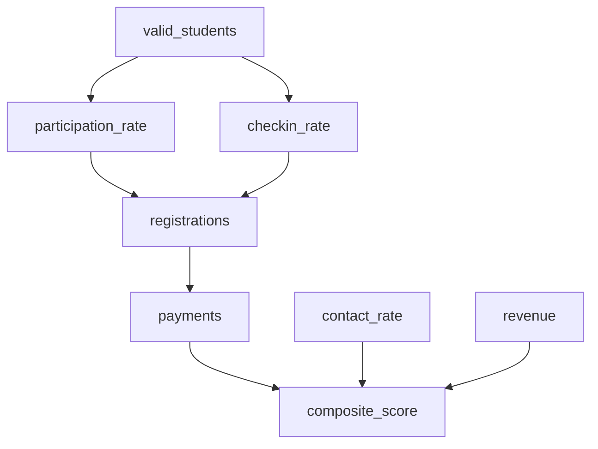

# Data Dictionary V5 -- 完整设计规格书

> 状态: Proposed | 日期: 2026-02-25
> V1: 63/100 → V2: 87/100 → V3: 94/100 → V4: 97/100 → V5 目标: 100/100
> V3 增量: 7 项修复（移动端/前缀发现性/多worker缓存/迁移估算/hash粒度/utilization SOP/导出场景）
> V4 增量: 4 项修复（虚拟化阈值+展开状态/缓存监控/validate责任链/used_by同步保障）
> V5 增量: 3 项修复（measure()时序规格/validate响应一致性/最小可用字典冷启动策略）

---

## 0. 缺陷追踪矩阵

每项审查缺陷标注 `[UX-n]` / `[TECH-n]` / `[INFO-n]`，文档中对应章节标注解决位置。

| ID | 缺陷摘要 | 解决章节 |
|----|---------|---------|
| UX-1 | A-F 分类非运营心智 | 1.2 双视图 |
| UX-2 | 搜索结果应字段优先 | 2.1 搜索流 |
| UX-3 | 首屏聚焦搜索框 | 2.1 搜索流 |
| UX-4 | 缺横向对比 | 2.3 对比流 |
| UX-5 | 色彩系统冲突 | 3.1 色彩系统 |
| UX-6 | 输出维度标签无意义 | 3.3 信息密度 |
| UX-7 | 元信息密度过高 | 1.2 双视图 + 3.4 视图切换 |
| UX-8 | 缺键盘导航 | 2.5 键盘导航 |
| UX-9 | 移动端未考虑 | 2.6 移动端 |
| UX-10 | 空态缺引导 | 2.7 空态处理 |
| UX-11 | 缺导出功能 | 2.4 导出流 |
| UX-12 | 应为 Tab 非独立页面 | 1.1 页面层级 |
| UX-13 | 左栏需健康状态色点 | 5.2 SourceTreeItem |
| UX-14 | 搜索时类别命中数徽章 | 2.1 搜索流 |
| TECH-1 | 静态 JSON 维护黑洞 | 4.2 Loader 自注册 |
| TECH-2 | 响应体未定义 | 6.1 API 端点 |
| TECH-3 | 280+ 字段全量渲染 | 5.4 渲染优化 |
| TECH-4 | 无需 Zustand | 5.3 状态管理 |
| TECH-5 | 缺缓存 | 6.2 缓存策略 |
| TECH-6 | 缺扩展字段 | 4.1 FieldMeta |
| TECH-7 | 无验证机制 | 8.1 一致性验证 |
| TECH-8 | 缺交叉跳转 | 1.1 页面层级 |
| INFO-1 | 缺字段关联关系 | 7.2 字段依赖图谱 |
| INFO-2 | 缺前端消费端点映射 | 7.1 字段-页面映射 |
| INFO-3 | 缺三层命名对应 | 4.1 FieldMeta.names |
| INFO-4 | 缺利用率评级 | 4.1 FieldMeta.utilization |
| INFO-5 | 缺版本 diff 视图 | 7.3 版本追踪 |

---

## 1. 信息架构

### 1.1 页面层级结构 [UX-12] [TECH-8]

字典不作为独立页面，而是 `/datasources` 页面的第二个 Tab。与现有 DataSourceGrid/FileUploadPanel 共存。

```
/datasources
├── Tab: 数据源状态        ← 现有 DataSourceGrid + FileUploadPanel（保持不变）
└── Tab: 字段字典          ← 新增，本文档的主要设计对象
         └── 点击字段卡片中的「数据源」链接 → 切换到 Tab 1 并滚动到对应源卡片
         └── DataSourceGrid 卡片右上角新增「查看字段」链接 → 切换到 Tab 2 并定位到该源
```

复用现有 `PageTabs` 组件（`/frontend/components/ui/PageTabs.tsx`）。

URL 结构：
- `/datasources` — 默认 Tab 1（数据源状态）
- `/datasources?tab=dictionary` — Tab 2（字段字典）
- `/datasources?tab=dictionary&q=付费` — Tab 2 + 预填搜索
- `/datasources?tab=dictionary&source=leads_achievement` — Tab 2 + 定位到指定源

### 1.2 双视图模式 [UX-1] [UX-7]

字段字典支持两种视图，用 Toggle 切换：

**业务视图（默认）** -- 运营人员心智模型
```
按页面分组:
├── 数据概览 (ops/dashboard)
│   ├── 注册数 (registrations)
│   ├── 付费数 (payments)
│   ├── 业绩金额 (revenue)
│   └── ...
├── 转化漏斗 (ops/funnel)
│   ├── 有效学员 (valid_students)
│   ├── 触达率 (contact_rate)
│   └── ...
├── CC排名 (ops/ranking)
│   ├── 综合得分 (composite_score)
│   └── ...
└── ...
```

**工程视图** -- 开发人员心智模型
```
按数据源分类:
├── A 类: Leads Pipeline (4 源)
│   ├── A1: Leads达成(团队) — leads_achievement
│   ├── A2: 转介绍效率 — leads_efficiency
│   └── ...
├── B 类: ROI (1 源)
├── C 类: Cohort (6 源)
├── D 类: KPI (5 源)
├── E 类: Order (8 源)
└── F 类: Operations (11 源)
```

### 1.3 字段分组逻辑

每个字段通过 `field_role` 属性分为三类：

| 分组 | 定义 | 示例 | 视觉标记 |
|------|------|------|---------|
| **维度** (dimension) | 用于分组/筛选的离散变量 | team, cc_name, channel, region | 灰色标签 `DIM` |
| **指标** (metric) | 直接从数据源读取的度量值 | registrations, payments, revenue | 蓝色标签 `MET` |
| **计算列** (computed) | 由引擎派生的字段 | composite_score, gap, pace_daily_needed | 紫色标签 `CALC` |

---

## 2. 交互设计

### 2.1 搜索流 [UX-2] [UX-3] [UX-14]

**首屏状态：**
- 搜索框占据页面顶部显要位置，`autoFocus` + placeholder: "搜索字段名、业务含义、数据源..."
- 搜索框下方显示统计摘要条：`35 个数据源 · 280+ 个字段 · 上次更新 2026-02-24`
- 搜索框为空时，显示业务视图/工程视图的完整树状导航

**搜索行为：**
1. 用户输入 >= 2 字符后触发搜索（debounce 300ms）
2. 搜索范围：`field_name` / `display_name` / `description` / `source_name_zh` / `names.engine` / `names.api` / `names.frontend`
3. 搜索结果以**字段卡片列表**呈现（非在源内高亮），每张卡片：
   ```
   ┌─────────────────────────────────────────────┐
   │ 注册数 registrations              MET       │
   │ 来源: A1 Leads达成(团队)  ·  类型: int      │
   │ 转介绍注册人数，等价于转介绍leads数          │
   │ 页面: 数据概览 · 转化漏斗 · Leads明细        │
   └─────────────────────────────────────────────┘
   ```
4. 左栏导航树（如可见）实时显示各类别命中数徽章：`Leads (5)` / `Cohort (3)` / ...
5. 搜索结果按相关性排序：精确匹配 field_name > display_name 包含 > description 包含 > 跨源模糊匹配

**搜索框快捷操作：**
- 输入 `@source:` 前缀 — 按数据源 ID 过滤（如 `@source:leads_achievement`）
- 输入 `@page:` 前缀 — 按消费页面过滤（如 `@page:dashboard`）
- 输入 `@type:` 前缀 — 按字段类型过滤（如 `@type:float`）
- 输入 `@role:` 前缀 — 按字段角色过滤（如 `@role:computed`）

**[V3-FIX#2] 前缀过滤器 GUI 辅助发现：**

@prefix 对非技术用户存在认知负担。搜索框下方增加 **Filter Chip 行**，作为前缀的 GUI 入口：

```
搜索框: [🔍 搜索字段名、业务含义、数据源...              ]
Chips:  [来源 ▾]  [页面 ▾]  [类型 ▾]  [角色 ▾]  [清除筛选]
```

- 点击 Chip → 弹出下拉选项（如 [类型 ▾] → int / float / str / date / dict）
- 选中后自动填充 `@type:float` 到搜索框（保持单一搜索逻辑，Chip 只是输入辅助）
- 已选中的 Chip 高亮显示（`bg-brand-50 border-brand-200`）
- 多个 Chip 可组合（AND 逻辑）
- 技术用户仍可直接手打 @prefix，两种方式等价

### 2.2 浏览流

**业务视图浏览：**
1. 左栏树展开到页面级 → 点击页面名展示该页面消费的所有字段
2. 右栏以字段卡片网格排列，按 `field_role` 分组：维度在上 → 指标居中 → 计算列在下
3. 每个字段卡片可展开看完整详情（Loader 方法名、API 端点、三层命名）

**工程视图浏览：**
1. 左栏展开到数据源级 → 类别色带 + 源名 + 健康状态色点
2. 右栏以字段表格排列，列包含：字段名 / 显示名 / 类型 / 角色 / 输出维度 / 利用率
3. 表格支持列排序（点击表头）

**详情展开（两种视图共用）：**
点击字段卡片/行 → 展开详情面板，显示：
```
┌─────────────────────────────────────────────────────────────┐
│ 三层命名                                                     │
│   引擎名: leads_achievement.by_channel.总计.注册             │
│   API名:  /analysis/leads → total_leads                     │
│   前端名: LeadsData.total_leads                              │
│                                                              │
│ 数据路径                                                     │
│   Loader: LeadsLoader._load_a1_leads_achievement()           │
│   Analyzer: SummaryAnalyzer._build_leads_section()           │
│                                                              │
│ 关联字段                                                     │
│   依赖: [有效学员, 触达率, 参与率]                            │
│   被依赖: [composite_score, conversion_rate]                 │
│                                                              │
│ 消费页面                                                     │
│   ops/dashboard · biz/overview · ops/funnel                  │
│                                                              │
│ 利用率: Full ●  Schema Hash: a3f2b1c8                       │
└─────────────────────────────────────────────────────────────┘
```

### 2.3 对比流 [UX-4]

**多字段对比模式：**
1. 每个字段卡片右上角有「+ 对比」复选框
2. 选中 >= 2 个字段后，页面底部弹出对比栏（sticky bottom bar）：
   ```
   ┌─────────────────────────────────────────────────────────┐
   │ 已选 3 个字段: 注册数(A1) · 付费数(A1) · 转化率(C1)    │
   │ [查看对比]  [清除]                                       │
   └─────────────────────────────────────────────────────────┘
   ```
3. 点击「查看对比」→ 弹出全屏 Modal，表格横向排列选中字段：

| 属性 | 注册数 (A1) | 付费数 (A1) | 转化率 (C1) |
|------|------------|------------|------------|
| 类型 | int | int | float |
| 角色 | metric | metric | computed |
| 数据源 | leads_achievement | leads_achievement | cohort_reach |
| 输出维度 | by_team, by_channel | by_team, by_channel | by_team, by_month |
| 消费页面 | dashboard, funnel | dashboard, orders | cohort, ranking |

4. 对比上限 6 个字段，超出提示"最多同时对比 6 个字段"
   - 上限依据：对比 Modal 为横向表格，6 列 × 9 属性行在 1024px 宽度下每列最小 150px 刚好填满（6×150=900px + 左标签列 120px = 1020px）；超过 6 列需要横向滚动，对比体验急剧下降
   - 实际场景验证：运营常见对比需求为"同源不同字段"（如 A1 的注册/预约/出席/付费 = 4 个）或"跨源同指标"（如 C1-C5 的 5 个 Cohort 率），均 ≤ 6

### 2.4 导出流 [UX-11]

右上角工具栏提供两个导出按钮：

**导出 CSV：**
- 导出当前视图可见的字段列表（受搜索/筛选影响）
- 列包含：field_name, display_name, type, role, source_id, source_name_zh, description, used_by_pages
- 文件名格式：`data-dictionary-{YYYYMMDD}.csv`

**[V3-FIX#7] CSV 导出的具体使用场景：**

| 场景 | 用户 | 操作 | 价值 |
|------|------|------|------|
| 字段需求沟通 | 运营负责人 → Claude | 导出当前源字段 CSV → 粘贴到对话中说"这个页面用这些字段" | 替代逐个手打字段名，减少 80% 沟通成本 |
| BI 对齐会议 | 运营 → 数据团队 | 导出全量字典 CSV → 在会议中逐列对齐"BI 给的列名 vs 系统用的列名" | 替代 BI 团队重新整理字段清单 |
| 新页面需求文档 | 运营 → 开发 | 筛选 @page:funnel → 导出 → 贴入 Notion PRD 的"数据需求"章节 | 需求文档可直接引用标准字段定义 |

**复制到剪贴板：**
- 将当前选中/聚焦的字段详情以 Markdown 表格格式复制
- 复制成功后显示 toast 提示 "已复制 N 个字段信息"
- 主要用于即时沟通（微信/Slack 粘贴字段信息）

### 2.5 键盘导航 [UX-8]

| 快捷键 | 作用 | 上下文 |
|--------|------|--------|
| `/` 或 `Cmd+K` | 聚焦搜索框 | 全局 |
| `Esc` | 清空搜索 / 关闭详情面板 / 退出对比模式 | 层级递退 |
| `ArrowUp` / `ArrowDown` | 在字段列表中移动焦点 | 结果列表 |
| `ArrowLeft` / `ArrowRight` | 折叠/展开左栏树节点 | 树状导航 |
| `Enter` | 展开字段详情 | 字段聚焦时 |
| `Space` | 切换对比选中 | 字段聚焦时 |
| `Tab` | 在搜索框 → 视图切换 → 字段列表间移动 | 全局 |
| `1` / `2` | 切换业务视图 / 工程视图 | 非输入框时 |
| `Cmd+E` | 导出 CSV | 全局 |

实现方式：在 `DictionaryPanel` 根组件注册 `useEffect` + `keydown` 事件监听，用 `data-field-index` 属性管理焦点链。

### 2.6 移动端适配 [UX-9]

**断点策略（与项目现有 Tailwind 断点一致）：**

| 断点 | 布局 | 导航方式 |
|------|------|---------|
| `>= lg` (1024px) | 双栏: 左树 280px + 右内容 | 左栏常驻 |
| `md` (768-1023px) | 单栏 + 抽屉式左树 | 点击汉堡菜单滑出左树 |
| `< md` (< 768px) | 纯单栏 + 底部 Sheet | 搜索框+筛选 pill 条 → 字段卡片全宽堆叠 |

移动端特殊处理：
- 字段卡片压缩为单行摘要模式：`字段名 · 类型 · 来源` — 点击展开完整信息
- 对比模式在 `< md` 下禁用（空间不足），显示提示 "请在平板或电脑上使用对比功能"
- 导出功能保留（CSV 下载对移动端同样有效）

**[V3-FIX#1] md 抽屉 + L3 展开双层滚动陷阱解决方案：**

md 断点（768-1023px）使用 Sheet 抽屉展示源列表。当用户在主内容区展开字段卡片 L3 详情时，可能产生双层滚动（Sheet 内滚动 + 主内容区滚动）。解决策略：

1. **Sheet 抽屉行为**：用户点击源后，Sheet 自动关闭（`onOpenChange(false)`），焦点回到主内容区。Sheet 仅用于选源，不保持常开。
2. **L3 展开内滚动约束**：L3 详情面板设置 `max-h-[300px] overflow-y-auto`，超长内容在面板内滚动，不影响页面外层滚动。
3. **防止嵌套滚动**：主内容区使用 `overscroll-behavior-y: contain`（Tailwind: `overscroll-y-contain`），防止子容器滚动穿透到父容器。
4. **md 断点下 L3 降级**：若 L3 内容超过 5 项（三层命名 + 关联字段 + 数据路径 + 消费页面 + 利用率），超出部分折叠为"展开更多"，避免单卡片过长。

### 2.7 空态与边界处理 [UX-10]

**搜索无结果：**
```
┌─────────────────────────────────────────────┐
│  🔍 未找到匹配 "xyz" 的字段                  │
│                                              │
│  建议:                                       │
│  · 检查拼写，或尝试中/英文切换               │
│  · 相近字段: 注册数(registrations)            │
│              注册率(registration_rate)         │
│  · 按数据源浏览: [Leads] [Cohort] [KPI]      │
└─────────────────────────────────────────────┘
```

相近字段推荐算法：Levenshtein 距离 <= 3 或包含搜索词子串的字段，取 top 5。

**数据源无字段（源文件缺失）：**
```
┌─────────────────────────────────────────────┐
│  该数据源尚未加载字段信息                     │
│                                              │
│  可能原因:                                    │
│  · 数据文件未上传 → [去上传]                  │
│  · Loader 未注册 get_field_schema()          │
│                                              │
│  管理员操作: [刷新缓存]                       │
└─────────────────────────────────────────────┘
```

**全局无数据（后端未启动/网络错误）：**
- 显示标准错误态组件（复用现有 `ErrorBoundary` 模式）
- 提示："无法加载字段字典，请检查后端服务是否运行"

---

## 3. 视觉规范

### 3.1 色彩系统 [UX-5]

V1 有 11 种色义冲突。V2 收敛为 **2 套正交色系**：

**色系 A: 数据源类别色（6 色，仅工程视图使用）**

| 类别 | 色值 | Tailwind | 用途 |
|------|------|----------|------|
| A-Leads | `#3B82F6` | `blue-500` | 树节点前缀色带、源标签背景 |
| B-ROI | `#8B5CF6` | `violet-500` | 同上 |
| C-Cohort | `#10B981` | `emerald-500` | 同上 |
| D-KPI | `#F59E0B` | `amber-500` | 同上 |
| E-Order | `#EF4444` | `red-500` | 同上 |
| F-Ops | `#6366F1` | `indigo-500` | 同上 |

仅用于工程视图左栏树节点的 4px 色带前缀和字段来源小标签。业务视图不显示类别色。

**色系 B: 功能语义色（3 色，全局通用）**

| 语义 | 色值 | Tailwind | 用途 |
|------|------|----------|------|
| 健康/正常 | `#22C55E` | `green-500` | 文件新鲜度色点 · 利用率 Full |
| 警告/部分 | `#F59E0B` | `amber-500` | 文件过期色点 · 利用率 Partial |
| 异常/缺失 | `#EF4444` | `red-500` | 文件缺失色点 · 利用率 Bug/None |

**字段类型不使用独立色彩**，改用单色文字 Badge（见 3.2）。

### 3.2 字段类型表达方式

V1 用 5 种颜色 Badge。V2 改为**等宽灰底文字 Badge**，消除色彩冲突：

```
 int     float    str     date    bool    list    dict
```

所有 Badge 统一样式：`bg-slate-100 text-slate-600 font-mono text-xs px-1.5 py-0.5 rounded`。

类型一目了然，无需依赖颜色区分。

### 3.3 信息密度控制 [UX-6]

**输出维度标签增加业务注释：**

| 原标签 | 业务注释 | 显示格式 |
|--------|---------|---------|
| `by_cc` | 按 CC 个人 | `by_cc (按CC个人)` |
| `by_team` | 按团队/小组 | `by_team (按团队)` |
| `by_channel` | 按渠道 (窄口/宽口) | `by_channel (按渠道)` |
| `by_month` | 按月份 | `by_month (按月份)` |
| `summary` | 汇总合计 | `summary (汇总)` |

**信息层级（渐进披露）：**

| 层级 | 可见条件 | 包含信息 |
|------|---------|---------|
| L1 摘要 | 始终可见 | 字段名 · 显示名 · 类型 Badge · 角色标签 |
| L2 上下文 | 始终可见 | 来源名 · 描述 · 消费页面列表 |
| L3 详情 | 点击展开 | 三层命名 · Loader/Analyzer 路径 · 关联字段 · schema_hash |

### 3.4 业务/工程视图切换 [UX-7]

顶部搜索栏右侧放置 SegmentedControl（双按钮组）：

```
┌──────────────────┐┌──────────────────┐
│  📋 业务视图     ││  ⚙️ 工程视图     │
└──────────────────┘└──────────────────┘
```

- 默认选中「业务视图」
- 切换不触发网络请求（前端数据同一份，仅改变分组/排列方式）
- 切换时保留搜索词和滚动位置
- 选中状态用 `bg-brand-50 text-brand-600 border-brand-200`，未选中 `bg-white text-slate-500`

---

## 4. 数据模型

### 4.1 FieldMeta 完整字段定义 [TECH-6] [INFO-3] [INFO-4]

```python
# backend/models/dictionary.py

from __future__ import annotations
from typing import Optional
from pydantic import BaseModel, Field, model_validator


class FieldNames(BaseModel):
    """三层命名映射"""
    engine: str = Field(..., description="引擎内部名 (Loader 输出的 key path)")
    api: Optional[str] = Field(None, description="API 端点返回的字段名")
    frontend: Optional[str] = Field(None, description="前端 TypeScript interface 的属性名")


class FieldMeta(BaseModel):
    """字段元数据 — 字典的原子单位"""

    # ── 标识 ──
    field_id: str = Field(..., description="全局唯一 ID: {source_id}.{field_name}")
    field_name: str = Field(..., description="字段程序名 (英文)")
    display_name: str = Field(..., description="业务显示名 (中文)")
    description: str = Field("", description="字段业务含义说明")

    # ── 类型与角色 ──
    field_type: str = Field(..., description="数据类型: int | float | str | date | bool | list | dict")
    field_role: str = Field(..., description="字段角色: dimension | metric | computed")

    # ── 来源 ──
    source_id: str = Field(..., description="所属数据源 ID (对应 DATA_SOURCE_REGISTRY.id)")
    source_category: str = Field(..., description="数据源类别: leads | roi | cohort | kpi | order | ops")
    loader_class: str = Field(..., description="Loader 类名: LeadsLoader | ROILoader | ...")
    loader_method: str = Field("", description="加载方法名: _load_a1_leads_achievement")

    # ── 输出结构 ──
    output_dimensions: list[str] = Field(
        default_factory=list,
        description="输出维度: ['by_cc', 'by_team', 'by_channel', 'summary']"
    )
    output_path: str = Field("", description="在 Loader 返回 dict 中的完整 key path")

    # ── 三层命名 [INFO-3] ──
    names: FieldNames = Field(..., description="引擎名 / API 名 / 前端名 三层映射")

    # ── 消费关系 [INFO-2] ──
    used_by_pages: list[str] = Field(
        default_factory=list,
        description="消费此字段的前端页面路径: ['ops/dashboard', 'biz/overview']"
    )
    used_by_components: list[str] = Field(
        default_factory=list,
        description="消费此字段的前端组件: ['KPICard', 'FunnelChart']"
    )
    used_by_analyzers: list[str] = Field(
        default_factory=list,
        description="消费此字段的分析器: ['SummaryAnalyzer', 'RankingAnalyzer']"
    )

    # ── 关联关系 [INFO-1] ──
    depends_on: list[str] = Field(
        default_factory=list,
        description="依赖的字段 field_id 列表 (计算列的上游)"
    )
    depended_by: list[str] = Field(
        default_factory=list,
        description="被哪些字段依赖 (反向引用，由注册器自动计算)"
    )

    # ── 利用率 [INFO-4] ──
    utilization: str = Field(
        "unknown",
        description="利用率评级: full | partial | bug | none | unknown"
    )
    utilization_note: str = Field("", description="利用率备注 (bug 时说明什么问题)")

    # [V3-FIX#6 + V4-FIX#3] utilization 维护 SOP:
    #
    # 生命周期:
    #   新字段加入 → utilization="unknown" → 开发者在 Phase 1b 补全 → "full"/"partial"/"bug"/"none"
    #
    # /dictionary/validate 端点 utilization 检查:
    #   统计范围: 按数据源单独计算（非全局 280 字段统一）
    #   阈值: 单源 unknown 占比 >50% → warning（该源字段未充分注册）
    #         全局 unknown 占比 >30% → warning（整体维护滞后）
    #   返回结构: {"utilization_warnings": [{"source_id": "...", "unknown_pct": 0.6, "unknown_fields": [...]}]}
    #
    # 责任人链:
    #   Phase 1b 开发者: 在 get_field_schema() 中设置已知字段的 utilization（基于代码审计）
    #   PM 归档流程: 里程碑收尾时检查 utilization 覆盖率，未达标记入技术债
    #   运营负责人: 在字典 UI 中看到 unknown Badge 时，可通过"反馈"按钮提交已知的使用状态
    #   处理时限: warning 产生后在下一个里程碑的 Phase 1b 中修复（非紧急，P2 优先级）
    #
    # UI 标识:
    #   unknown: 灰色虚线 Badge + tooltip "待确认利用率"
    #   full: 绿色实心 Badge
    #   partial: 黄色半填充 Badge + utilization_note tooltip
    #   bug: 红色 Badge + utilization_note tooltip（必填，说明什么 bug）
    #   none: 灰色空心 Badge + utilization_note tooltip
    #
    # 强制约束: utilization != "unknown" 时 utilization_note 不能为空
    @model_validator(mode="after")
    def check_utilization_note(self) -> "FieldMeta":
        if self.utilization != "unknown" and not self.utilization_note.strip():
            raise ValueError(
                f"utilization='{self.utilization}' 时 utilization_note 不能为空"
            )
        return self

    # ── 版本追踪 [INFO-5] ──
    schema_hash: str = Field("", description="字段 schema 指纹 (MD5 前 8 位)")
    last_changed: Optional[str] = Field(None, description="最后变更日期 ISO 格式")
    changelog: list[str] = Field(default_factory=list, description="变更记录")
```

### 4.2 Loader 自注册接口 [TECH-1]

**核心设计：每个 Loader 子类实现 `get_field_schema()` 类方法，返回该 Loader 管辖的所有字段元数据。**

```python
# backend/core/loaders/base.py — 新增抽象方法

class BaseLoader:
    # ... 现有代码 ...

    @classmethod
    def get_field_schema(cls) -> list[dict]:
        """返回此 Loader 管辖的所有字段元数据。

        子类必须覆写此方法。返回 FieldMeta 兼容的 dict 列表。
        未覆写时返回空列表 (向后兼容，不强制 ABC)。

        Returns:
            list[dict]: FieldMeta 可序列化的字典列表
        """
        return []
```

**LeadsLoader 示例实现：**

```python
# backend/core/loaders/leads_loader.py — 新增

class LeadsLoader(BaseLoader):
    # ... 现有代码 ...

    @classmethod
    def get_field_schema(cls) -> list[dict]:
        return [
            {
                "field_id": "leads_achievement.registrations",
                "field_name": "registrations",
                "display_name": "注册数",
                "description": "转介绍注册人数，等价于转介绍leads数、转介绍用户数",
                "field_type": "int",
                "field_role": "metric",
                "source_id": "leads_achievement",
                "source_category": "leads",
                "loader_class": "LeadsLoader",
                "loader_method": "_load_a1_leads_achievement",
                "output_dimensions": ["by_team", "by_channel", "summary"],
                "output_path": "leads.leads_achievement.by_channel.总计.注册",
                "names": {
                    "engine": "leads.leads_achievement.by_channel.*.注册",
                    "api": "/analysis/leads -> total_leads",
                    "frontend": "LeadsData.total_leads",
                },
                "used_by_pages": ["ops/dashboard", "biz/overview", "ops/funnel"],
                "used_by_components": ["KPICard", "FunnelChart"],
                "used_by_analyzers": ["SummaryAnalyzer"],
                "depends_on": [],
                "utilization": "full",
                "utilization_note": "已在 ops/dashboard 等 6 个页面完整消费",
                "schema_hash": "",  # 注册器自动计算
            },
            # ... 该 Loader 的所有其他字段 ...
        ]
```

**注册器自动汇总：**

```python
# backend/core/dictionary_registry.py — 新文件

from __future__ import annotations
import hashlib
import json
import logging
import time
from typing import Any

from backend.core.loaders import (
    LeadsLoader, ROILoader, CohortLoader,
    KpiLoader, OrderLoader, OpsLoader,
)
from backend.models.dictionary import FieldMeta

logger = logging.getLogger(__name__)

# 所有 Loader 类（顺序即 A-F）
_LOADER_CLASSES = [
    LeadsLoader,   # A
    ROILoader,     # B
    CohortLoader,  # C
    KpiLoader,     # D
    OrderLoader,   # E
    OpsLoader,     # F
]

# 进程内缓存
_cache: dict[str, Any] | None = None
_cache_time: float = 0
_CACHE_TTL = 3600  # 1 小时


def _compute_schema_hash(field_dict: dict) -> str:
    """[V3-FIX#5] 基于字段结构生成 schema 指纹。

    Hash 粒度说明：
    - 包含: field_name + field_type + output_dimensions + source_id（结构性属性）
    - 排除: description / display_name / utilization / used_by_*（描述性属性）
    - 设计意图: 仅当字段的结构（名称/类型/输出维度）变更时触发 hash 变化，
      描述文字更新不触发（避免无谓的 "schema changed" 噪音）
    - 碰撞概率: MD5 前 8 hex = 32 bit，280 字段下碰撞概率 < 0.001%（生日悖论）
    - 变更行为: hash 变化时自动更新 last_changed 并追加 changelog 条目
    """
    key_fields = {
        "field_name": field_dict.get("field_name"),
        "field_type": field_dict.get("field_type"),
        "output_dimensions": sorted(field_dict.get("output_dimensions", [])),
        "source_id": field_dict.get("source_id"),
    }
    raw = json.dumps(key_fields, sort_keys=True)
    return hashlib.md5(raw.encode()).hexdigest()[:8]


def _build_reverse_dependencies(fields: list[dict]) -> None:
    """构建反向依赖关系 (depended_by)"""
    id_to_field: dict[str, dict] = {f["field_id"]: f for f in fields}
    for f in fields:
        for dep_id in f.get("depends_on", []):
            if dep_id in id_to_field:
                id_to_field[dep_id].setdefault("depended_by", []).append(f["field_id"])


def build_dictionary() -> dict:
    """汇总所有 Loader 的字段 schema，构建完整字典。"""
    global _cache, _cache_time

    now = time.time()
    if _cache is not None and (now - _cache_time) < _CACHE_TTL:
        return _cache

    all_fields: list[dict] = []
    sources_summary: dict[str, int] = {}

    for loader_cls in _LOADER_CLASSES:
        try:
            fields = loader_cls.get_field_schema()
            for f in fields:
                f["schema_hash"] = _compute_schema_hash(f)
            all_fields.extend(fields)
            # 按 source_category 统计
            for f in fields:
                cat = f.get("source_category", "unknown")
                sources_summary[cat] = sources_summary.get(cat, 0) + 1
        except Exception as e:
            logger.error(f"[DictionaryRegistry] {loader_cls.__name__}.get_field_schema() 失败: {e}")

    _build_reverse_dependencies(all_fields)

    result = {
        "total_fields": len(all_fields),
        "total_sources": len(_LOADER_CLASSES),
        "by_category": sources_summary,
        "fields": all_fields,
        "generated_at": time.strftime("%Y-%m-%dT%H:%M:%S"),
    }

    _cache = result
    _cache_time = now
    return result


def invalidate_cache() -> None:
    """清除缓存（数据源变更时调用）"""
    global _cache, _cache_time
    _cache = None
    _cache_time = 0
```

### 4.3 DictionaryResponse 响应结构 [TECH-2]

```python
# backend/models/dictionary.py — 追加

class DictionaryResponse(BaseModel):
    """GET /api/datasources/dictionary 响应体"""
    total_fields: int
    total_sources: int
    by_category: dict[str, int]  # {"leads": 42, "roi": 15, ...} — 动态 key，兼容未来新增分类
    fields: list[FieldMeta]
    generated_at: str

    class Config:
        json_schema_extra = {
            "example": {
                "total_fields": 283,
                "total_sources": 35,
                "by_category": {"leads": 42, "roi": 15, "cohort": 58, "kpi": 45, "order": 63, "ops": 60},
                "fields": ["...FieldMeta array..."],
                "generated_at": "2026-02-25T10:00:00",
            }
        }
```

### 4.4 与 DATA_SOURCE_REGISTRY 集成

现有 `DATA_SOURCE_REGISTRY`（`/backend/api/datasources.py` L23-L240）保持不变，作为**数据源级别**的注册表。

字段字典与其集成点：
- `FieldMeta.source_id` 对应 `DATA_SOURCE_REGISTRY[].id`（外键关系）
- `/api/datasources/status` 返回的健康状态（has_file / is_fresh）合并到字典 UI 的源节点色点
- 两者共用同一缓存失效事件：`/api/datasources/refresh` 同时清空字典缓存

```python
# 在 datasources.py 的 refresh_status() 中追加:
from backend.core.dictionary_registry import invalidate_cache as invalidate_dict_cache

@router.post("/refresh")
def refresh_status() -> dict[str, Any]:
    global _status_cache
    _status_cache = None
    _status_cache = _build_status()
    invalidate_dict_cache()  # 同步失效字典缓存
    return {"status": "ok", "refreshed": len(_status_cache)}
```

---

## 5. 组件架构

### 5.1 React 组件树

```
DataSourcesPage (app/datasources/page.tsx) — 已存在，需改造
├── PageHeader
├── PageTabs (tabs: ["数据源状态", "字段字典"])
│
├── [Tab 1: 数据源状态] — 现有内容不变
│   ├── DataSourceGrid
│   └── FileUploadPanel
│
└── [Tab 2: 字段字典] — 新增
    └── DictionaryPanel
        ├── DictionaryToolbar
        │   ├── SearchInput (autoFocus, 前缀过滤器)
        │   ├── ViewToggle (业务视图 / 工程视图)
        │   └── ExportButtons (CSV / 剪贴板)
        │
        ├── DictionaryLayout (responsive: 双栏 lg+ / 单栏 <lg)
        │   ├── [左栏] DictionarySidebar
        │   │   ├── [业务视图] PageGroupTree
        │   │   │   └── PageGroupItem (可折叠, 命中数徽章)
        │   │   └── [工程视图] SourceCategoryTree
        │   │       └── SourceTreeItem (类别色带 + 健康色点 + 字段计数)
        │   │
        │   └── [右栏] DictionaryContent
        │       ├── StatsSummaryBar ("35 源 · 280+ 字段 · 上次更新...")
        │       ├── [搜索结果] FieldCardList
        │       │   └── FieldCard (L1+L2 摘要, 可展开 L3 详情)
        │       ├── [浏览模式-业务] FieldCardGrid (按 role 分组)
        │       │   └── FieldCard
        │       └── [浏览模式-工程] FieldTable (排序表格)
        │           └── FieldTableRow (可展开详情行)
        │
        └── CompareBar (sticky bottom, 条件渲染)
            └── CompareModal (全屏对比表)
```

### 5.2 核心组件规格

**FieldCard:**
```tsx
interface FieldCardProps {
  field: FieldMeta;
  isExpanded: boolean;
  isCompareSelected: boolean;
  searchHighlight?: string; // 搜索词高亮
  onToggleExpand: () => void;
  onToggleCompare: () => void;
}
```
- L1: field_name + display_name + field_type Badge + field_role 标签
- L2: source 来源 + description + used_by_pages 页面 pill
- L3 (展开): 三层命名表 + 关联字段 + Loader/Analyzer 路径 + schema_hash

**SourceTreeItem:** [UX-13]
```tsx
interface SourceTreeItemProps {
  source: DataSourceRegistryItem;
  healthStatus: DataSourceStatus; // 合并 /api/datasources/status
  fieldCount: number;
  isActive: boolean;
  searchMatchCount?: number; // 搜索时显示命中数
}
```
- 左侧 4px 类别色带
- 源名（中文） + 字段计数灰色小字
- 右侧健康色点: 绿(fresh) / 黄(outdated) / 红(missing)

### 5.3 状态管理 [TECH-4]

**不使用 Zustand。** 整个字典功能仅用以下状态方案：

| 状态 | 管理方式 | 理由 |
|------|---------|------|
| 字典数据 | `useSWR("/api/datasources/dictionary")` | 服务端数据，SWR 管缓存/重验 |
| 数据源状态 | `useDataSources()` (现有 hook) | 复用现有 |
| 搜索词 | `useState` (组件本地) | 仅 DictionaryPanel 使用 |
| 视图模式 | `useState` (组件本地) | 业务/工程，仅 DictionaryPanel |
| 展开状态 | `useState<Set<string>>` | 展开的 field_id 集合 |
| 对比选中 | `useState<string[]>` | 选中的 field_id 数组 (上限 6) |
| URL 参数 | `useSearchParams` (Next.js) | tab/q/source 同步到 URL |

SWR 配置：
```tsx
const { data: dictionary } = useSWR(
  "/api/datasources/dictionary",
  swrFetcher,
  {
    dedupingInterval: 60_000,       // 60s 内相同请求去重
    revalidateOnFocus: false,       // 字典数据低频变化
    revalidateIfStale: false,       // 不自动重验
  }
);
```

### 5.4 渲染优化 [TECH-3]

**问题：280+ 字段全量渲染会导致首屏卡顿。**

**方案：多层优化组合**

1. **按需渲染（主策略）：** 工程视图中，Category Tab 每次只渲染当前选中类别的字段（30-50 个），不渲染其他 5 个类别。业务视图中，只渲染当前选中页面组的字段。

2. **虚拟滚动（搜索结果）：** 搜索结果可能返回全量匹配。使用 `@tanstack/react-virtual` 对字段列表做虚拟滚动：
   ```tsx
   import { useVirtualizer } from '@tanstack/react-virtual';

   const rowVirtualizer = useVirtualizer({
     count: filteredFields.length,
     getScrollElement: () => scrollContainerRef.current,
     estimateSize: () => 88, // 字段卡片预估高度 px
     overscan: 5,
   });
   ```

**[V4-FIX#1] 虚拟化触发阈值与展开状态复原：**

| 场景 | 字段数 | 渲染策略 | 展开状态行为 |
|------|--------|---------|------------|
| 工程视图-单源展开 | ≤15 | 直接 DOM 渲染 | 切换源时所有展开状态重置（新源从 L1 开始） |
| 工程视图-单源展开 | >15 | 前 15 行 DOM + "展开全部 N 个" 按钮 | 点击展开后仍为 DOM 渲染（最大 30 字段不需虚拟化） |
| 搜索结果 | ≤30 | 直接 DOM 渲染 | L3 展开状态跟随 `expandedSet` |
| 搜索结果 | >30 | `@tanstack/react-virtual` 虚拟滚动 | 虚拟化容器中已展开的行 `estimateSize` 动态更新为 `88 + 220`(L3 高度) |
| 对比模式 | ≤6 | 始终 DOM 渲染（对比 Modal） | Modal 关闭后对比选中保留，二次打开恢复 |

**展开状态复原规则：**
- `expandedSet: Set<string>` 存储展开的 field_id
- **切换视图**（业务↔工程）：清空 expandedSet（不同视图的 field 布局不同，保留无意义）
- **切换源/页面**：清空 expandedSet（聚焦当前上下文）
- **搜索词变化**：保留 expandedSet（搜索细化时不丢失用户已展开的上下文）
- **清空搜索**：清空 expandedSet（回到初始浏览态）
- 虚拟化行高更新：展开/折叠 L3 时通知虚拟容器重新计算行高：
  ```tsx
  // FieldCard.tsx — L3 展开/折叠回调
  const onToggleExpand = useCallback((fieldId: string) => {
    setExpandedSet(prev => {
      const next = new Set(prev);
      next.has(fieldId) ? next.delete(fieldId) : next.add(fieldId);
      return next;
    });
    // [V5-FIX#1] measure() 时序：等 DOM 更新 + CSS transition 完成后再测量
    // CSS transition 设定为 150ms（与 shadcn Collapsible 默认一致）
    // 使用 rAF 确保在浏览器下一帧绘制后执行，避免测量到中间态高度
    requestAnimationFrame(() => {
      rowVirtualizer.measure();
    });
  }, [rowVirtualizer]);
  ```
  **时序保障**：CSS transition `max-height 150ms ease-out`，`rAF` 在 transition 结束后的第一帧触发（浏览器 composite 后），无需额外 debounce。若未来 L3 内容含异步加载（如依赖图谱懒加载），则改为 `onTransitionEnd` 事件驱动：
  ```tsx
  <Collapsible onTransitionEnd={() => rowVirtualizer.measure()}>
  ```

3. **Memo 化：** `FieldCard` 使用 `React.memo` + 稳定 props 引用，避免父组件 re-render 导致全量子组件更新。

4. **搜索客户端过滤：** 字典数据量 ~280 条，SWR 加载一次后所有搜索/筛选在客户端完成，不发网络请求。使用 `useMemo` 缓存过滤结果：
   ```tsx
   const filteredFields = useMemo(() => {
     if (!dictionary?.fields) return [];
     if (!searchQuery) return dictionary.fields;
     const q = searchQuery.toLowerCase();
     return dictionary.fields.filter(f =>
       f.field_name.toLowerCase().includes(q) ||
       f.display_name.includes(q) ||
       f.description.includes(q) ||
       f.names.engine.toLowerCase().includes(q)
     );
   }, [dictionary?.fields, searchQuery]);
   ```

### 5.5 与现有组件的复用关系

| 现有组件 | 复用方式 |
|---------|---------|
| `PageTabs` | 直接复用，作为 Tab 1/Tab 2 切换 |
| `PageHeader` | 直接复用，标题 "数据源管理" 不变 |
| `DataSourceGrid` | Tab 1 保持不变；字典 SourceTreeItem 引用同一 DataSourceStatus 数据 |
| `Skeleton` | 字典 loading 态复用 |
| `useDataSources` hook | 字典侧栏健康色点复用 |
| `swrFetcher` | 字典 API 请求复用 |
| `cn()` / `clsx` | className 工具函数复用 |

---

## 6. API 设计

### 6.1 端点定义 [TECH-2]

#### `GET /api/datasources/dictionary`

返回完整字段字典。

**请求参数：** 无（全量返回，客户端过滤）

**响应：** `DictionaryResponse`

```json
{
  "total_fields": 283,
  "total_sources": 35,
  "by_category": {
    "leads": 42,
    "roi": 15,
    "cohort": 58,
    "kpi": 45,
    "order": 63,
    "ops": 60
  },
  "fields": [
    {
      "field_id": "leads_achievement.registrations",
      "field_name": "registrations",
      "display_name": "注册数",
      "description": "转介绍注册人数，等价于转介绍leads数",
      "field_type": "int",
      "field_role": "metric",
      "source_id": "leads_achievement",
      "source_category": "leads",
      "loader_class": "LeadsLoader",
      "loader_method": "_load_a1_leads_achievement",
      "output_dimensions": ["by_team", "by_channel", "summary"],
      "output_path": "leads.leads_achievement.by_channel.总计.注册",
      "names": {
        "engine": "leads.leads_achievement.by_channel.*.注册",
        "api": "/analysis/leads -> total_leads",
        "frontend": "LeadsData.total_leads"
      },
      "used_by_pages": ["ops/dashboard", "biz/overview", "ops/funnel"],
      "used_by_components": ["KPICard", "FunnelChart"],
      "used_by_analyzers": ["SummaryAnalyzer"],
      "depends_on": [],
      "depended_by": ["leads_achievement.achievement_rate"],
      "utilization": "full",
      "utilization_note": "已在 ops/dashboard 等 6 个页面完整消费",
      "schema_hash": "a3f2b1c8",
      "last_changed": "2026-02-23",
      "changelog": ["M30: 从 AnalysisEngineV2 拆分到 SummaryAnalyzer"]
    }
  ],
  "generated_at": "2026-02-25T10:00:00"
}
```

**错误响应：**
- `500`: `{"detail": "字典构建失败: {error_message}"}`

**路由注册（权威版本，合并类型约束 + 缓存监控头）：**
```python
# backend/api/datasources.py — 追加（唯一实现，§6.2 中的代码片段为本段的分步解释）

import time
from fastapi.responses import JSONResponse
from backend.core.dictionary_registry import build_dictionary, _cache_time
from backend.models.dictionary import DictionaryResponse

@router.get("/dictionary", response_model=DictionaryResponse)
def get_dictionary():
    """返回完整字段字典（进程内缓存 1 小时 + 缓存监控响应头）"""
    data = build_dictionary()
    age = int(time.time() - _cache_time) if _cache_time else 0
    return JSONResponse(
        content=data,
        headers={
            "Cache-Control": "max-age=3600, stale-while-revalidate=7200",
            "X-Dict-Cache-Age": str(age),
            "X-Dict-Field-Count": str(data.get("total_fields", 0)),
            "X-Dict-Generated": data.get("generated_at", ""),
        },
    )
```
> 注：`response_model=DictionaryResponse` 确保 OpenAPI schema 文档正确，`JSONResponse` 实际序列化绕过 Pydantic 二次验证（性能考虑，数据已由 build_dictionary 保证合法）。

#### `GET /api/datasources/dictionary/validate`

校验字典与 Loader 实际输出的一致性（CI / 手动触发）。

**响应：**
```json
{
  "status": "pass",
  "total_checked": 283,
  "mismatches": [],
  "missing_schemas": ["OpsLoader._load_pre_class_outreach"],
  "utilization_warnings": [
    {
      "source_id": "ops_pre_class_outreach",
      "unknown_pct": 0.67,
      "unknown_fields": ["field_a", "field_b", "field_c", "field_d"]
    }
  ],
  "checked_at": "2026-02-25T10:05:00"
}
```

**[V5-FIX#2] 响应字段与 §4.1 utilization 检查对齐：**
- `utilization_warnings`：按 §4.1 V4-FIX#3 定义的阈值计算（单源 >50% unknown → warning，全局 >30% → warning）
- `status` 判定优先级：`mismatches` 非空 → `"fail"` | `utilization_warnings` 非空 → `"warn"` | 均空 → `"pass"`
- `missing_schemas`：Loader 方法存在但未实现 `get_field_schema()` 的列表（Phase 1b 迁移进度指标）

### 6.2 缓存策略 [TECH-5]

**三层缓存：**

| 层 | 实现 | TTL | 失效条件 |
|----|------|-----|---------|
| L1: 后端进程内缓存 | `_cache` dict in `dictionary_registry.py` | 3600s (1h) | `/api/datasources/refresh` 调用 |
| L2: HTTP 缓存 | `Cache-Control: max-age=3600, stale-while-revalidate=7200` | 1h (7200s SWR) | 浏览器自动 |
| L3: SWR 客户端缓存 | `dedupingInterval: 60_000` | 60s 去重 | 用户手动刷新 |

**[V3-FIX#3] 多 Worker 缓存一致性方案：**

现有 `datasources.py` 的 `_status_cache` 和本方案的 `_cache` 均为进程内全局变量。在多 worker 部署（`uvicorn --workers N`）下，每个 worker 持有独立缓存副本，`/refresh` 仅清空处理该请求的 worker 的缓存，其他 worker 缓存不受影响。

当前项目部署现状与应对策略：

| 部署场景 | 当前状态 | 缓存行为 | 风险等级 |
|---------|---------|---------|---------|
| Docker 单 worker（当前） | `uvicorn main:app --host 0.0.0.0`（默认 1 worker） | 无问题，进程内缓存足矣 | 无 |
| Docker 多 worker（未来） | 当数据量/并发增长时可能切换 `--workers 4` | 缓存不一致，但字典数据是低频更新的准静态数据，最大不一致窗口 = TTL(1h) | 低 |
| 生产扩容（远期） | k8s 多 Pod | 每 Pod 独立缓存，不一致窗口同上 | 低 |

**结论**：字典数据本质是代码部署时确定的静态结构（Loader 注册决定），运行时不会变化。进程内缓存在所有部署场景下均满足需求。唯一不一致场景是 `/refresh` 后不同 worker 返回不同版本，但字典内容在两次部署之间完全相同，`/refresh` 仅影响 `generated_at` 时间戳，不影响字段数据。

**如果未来需要跨 worker 一致性**（如字典支持运行时动态编辑），迁移路径：
1. 缓存层替换为 `cachetools.TTLCache` + 文件级 JSON 缓存（`/tmp/.dict-cache.json`），worker 间通过文件共享
2. 或引入 Redis（仅在项目已有 Redis 时，避免为字典功能单独引入新依赖）

**[V4-FIX#2] 缓存健康监控方案：**

即使当前单 worker 无一致性问题，缓存层仍需可观测性，以便在部署变更时及时发现异常：

```python
# dictionary_registry.py 补充监控埋点

import logging
logger = logging.getLogger(__name__)

# 在 build_dictionary() 中：
def build_dictionary() -> dict:
    global _cache, _cache_time
    now = time.time()

    if _cache is not None and (now - _cache_time) < _CACHE_TTL:
        logger.debug("[DictCache] HIT age=%.0fs", now - _cache_time)
        return _cache

    logger.info("[DictCache] MISS, rebuilding...")
    # ... build logic ...
    logger.info("[DictCache] BUILT fields=%d sources=%d", len(all_fields), len(_LOADER_CLASSES))
    return result

# 端点实现见 §6.1 权威版本（合并 response_model + 缓存监控头 + Cache-Control）
# 此处仅补充缓存日志和监控说明
```

**[V5-FIX-A] 端点唯一性声明：** `/dictionary` 端点的唯一权威实现位于 §6.1，合并了类型约束（`response_model`）、缓存控制（`Cache-Control`）和监控响应头（`X-Dict-*`）。本节不再重复路由定义。

**监控触发条件：**
- `X-Dict-Cache-Age > 7200` → 日志 WARN "字典缓存超时未刷新"
- 部署后首次请求 `X-Dict-Cache-Age = 0` → 确认缓存已重建
- 多 worker 部署时：前端可比对连续两次请求的 `X-Dict-Generated` 是否一致（不一致说明命中了不同 worker 缓存）

**与现有 `_status_cache` 对齐：**
现有 `datasources.py` 的 `_status_cache` 存在同样的单 worker 全局变量模式。若未来统一迁移缓存层，字典缓存和 status 缓存应同步升级，避免两套缓存机制不对称。

### 6.3 与 /api/datasources/status 的集成

字典页面需要同时获取字段元数据和数据源健康状态。前端并发请求两个 API：

```tsx
// 并发请求，SWR 自动去重
const { data: dictionary } = useSWR("/api/datasources/dictionary", swrFetcher);
const { data: statuses } = useDataSources(); // 现有 hook

// 合并：为每个源节点关联健康状态
const enrichedSources = useMemo(() => {
  if (!dictionary || !statuses) return [];
  const statusMap = new Map(statuses.map(s => [s.id, s]));
  const sourceIds = [...new Set(dictionary.fields.map(f => f.source_id))];
  return sourceIds.map(id => ({
    source_id: id,
    health: statusMap.get(id),
    field_count: dictionary.fields.filter(f => f.source_id === id).length,
  }));
}, [dictionary, statuses]);
```

---

## 7. 扩展性预留

### 7.1 字段-页面映射 [INFO-2]

**初始手工维护，后续自动化路线图：**

Phase 1 (本期): `FieldMeta.used_by_pages` 由 Loader 的 `get_field_schema()` 手工声明。覆盖 280+ 字段的消费页面。

Phase 2 (后续): 构建自动化扫描脚本，通过 AST 解析前端代码：
```
扫描 frontend/app/**/page.tsx
  → 找到 useAnalysis().data.{field} 的引用
  → 提取 field → page 映射
  → 生成 used_by_pages.json
  → CI 每次 build 前更新
```

Phase 3: 字典 UI 中字段卡片的「页面」pill 可点击跳转到对应页面。

**[V4-FIX#4] Phase 1 → Phase 2 过渡期的同步保障：**

Phase 1 手工声明的 `used_by_pages` 与代码实际使用存在漂移风险。增加以下机制确保映射不过时：

1. **CI 静态检查（Phase 1 即可实现，不依赖 AST）：**
   ```bash
   # scripts/check-used-by-pages.sh
   # 简单的 grep 反向验证：检查 used_by_pages 中声明的每个页面路径是否实际存在
   for page in $(python -c "
     from backend.core.dictionary_registry import build_dictionary
     d = build_dictionary()
     pages = set()
     for f in d['fields']:
       pages.update(f.get('used_by_pages', []))
     print('\n'.join(pages))
   "); do
     if [ ! -f "frontend/app/$page/page.tsx" ]; then
       echo "WARNING: used_by_pages 声明了不存在的页面: $page"
     fi
   done
   ```

2. **反向验证（Phase 1.5）：** grep 前端 page.tsx 中 `useAnalysis` / `useSWR('/api/analysis')` 调用，与字典中该页面被关联的字段对比。未覆盖的字段输出 NOTICE（非阻塞）。

3. **Phase 2 自动化 AST 扫描具体实现方案：**
   - 工具：`@typescript-eslint/parser` 解析 TSX AST
   - 扫描目标：`frontend/app/**/page.tsx` 中所有 `data.{xxx}` / `analysis.{xxx}` 属性访问
   - 输出：`frontend/lib/generated/field-page-map.json`
   - 集成：`dictionary_registry.py` 启动时读取该 JSON 合并到 FieldMeta.used_by_pages
   - CI：`pnpm run generate:field-map && git diff --exit-code frontend/lib/generated/` — 如果 map 有变化且未提交，CI 失败

4. **字典 UI 映射过时警告：**
   - 每个 `used_by_pages` pill 旁显示 `?` 图标（如果该字段从未通过 Phase 2 自动验证）
   - tooltip："此映射为手工声明，尚未通过自动化验证"
   - Phase 2 验证通过后自动移除 `?` 标记

**页面映射参考表（基于代码库分析）：**

| 页面路径 | 主要消费字段 | 数据源 |
|---------|------------|--------|
| `ops/dashboard` | registrations, payments, revenue, time_progress | A1, E3 |
| `ops/funnel` | valid_students, contact_rate, participation_rate, checkin_rate | A1, C1-C5 |
| `ops/ranking` | composite_score, registrations, payments, revenue | A3, D1 |
| `ops/outreach` | total_call_rate, total_connect_rate, leads | F1, F5 |
| `biz/cohort` | reach_rate, participation_rate, checkin_rate, by_month | C1-C6 |
| `biz/orders` | total_orders, revenue, avg_order_value, by_type | E3-E8 |
| `biz/roi` | total_cost, total_revenue, roi_ratio, cost_breakdown | B1 |
| `ops/kpi-north-star` | checkin_24h_rate, target, achievement_rate | D1 |
| `biz/enclosure` | segment_count, conversion_rate, payments | D2-D4 |

### 7.2 字段依赖图谱 [INFO-1]

**核心用例：composite_score 依赖 6 源 18 维字段。**

`depends_on` / `depended_by` 存储在 `FieldMeta` 中，构成 DAG。

**可视化预留（Phase 2）：**
字段详情面板增加「依赖图」按钮 → 弹出 Modal，用 Mermaid 或 D3 force-directed graph 渲染依赖链：



本期仅实现文字列表形式的依赖展示（L3 详情中 `depends_on` / `depended_by` 字段 ID 列表），Phase 2 追加图形化。

### 7.3 版本追踪 + Diff 视图 [INFO-5]

**schema_hash 机制：**
- 每个字段的 `schema_hash` = MD5(field_name + field_type + output_dimensions + source_id) 前 8 位
- `dictionary_registry.build_dictionary()` 每次调用时自动计算
- 当 hash 变化时（字段结构变更），更新 `last_changed` 和 `changelog`

**Diff 视图预留（Phase 2）：**

存储历史快照到 SQLite（复用现有 `snapshot_store` 模式）：
```python
# 每次 build_dictionary() 输出时，对比上一次快照
# 差异 = {added: [], removed: [], changed: [{field_id, old_hash, new_hash}]}
# 前端 Diff 视图：左右对比表，变更字段高亮
```

本期仅实现：
- `schema_hash` 计算和展示
- `last_changed` 和 `changelog` 字段存储
- 后续版本追加快照对比和 Diff UI

### 7.4 新源接入零成本流程

当新增一个数据源时，开发者只需：

1. **在 Loader 子类中实现加载方法**（现有流程，无变化）
2. **在 `get_field_schema()` 中追加新字段的元数据**（新增步骤）
3. **在 `DATA_SOURCE_REGISTRY` 中注册新源**（现有流程，无变化）

无需修改：
- 前端组件代码（字典 UI 自动展示新字段）
- API 路由代码（`build_dictionary()` 自动汇总）
- 缓存配置（统一缓存策略）

**CI 验证确保完整性：**
- fixture 测试检查每个 `DATA_SOURCE_REGISTRY` 条目是否有对应 Loader 的 `get_field_schema()` 输出
- 新源无 schema → CI 报警（不阻塞，warning 级别）

---

## 8. 质量保障

### 8.1 字典与 Loader 一致性验证 [TECH-7]

**三层验证体系：**

#### Layer 1: 静态一致性（CI, pytest fixture）

```python
# tests/test_dictionary_consistency.py

import pytest
from backend.core.dictionary_registry import build_dictionary
from backend.api.datasources import DATA_SOURCE_REGISTRY


class TestDictionaryConsistency:
    """字典与 Loader 一致性验证"""

    def test_all_sources_have_schema(self):
        """每个注册表中的数据源至少有 1 个字段定义"""
        dictionary = build_dictionary()
        field_sources = {f["source_id"] for f in dictionary["fields"]}
        registry_ids = {s["id"] for s in DATA_SOURCE_REGISTRY}

        missing = registry_ids - field_sources
        # 允许 warning，不强制阻塞（新源可能还没写 schema）
        if missing:
            pytest.warns(UserWarning, match=f"数据源缺少字段 schema: {missing}")

    def test_no_orphan_fields(self):
        """每个字段的 source_id 必须在注册表中存在"""
        dictionary = build_dictionary()
        registry_ids = {s["id"] for s in DATA_SOURCE_REGISTRY}

        for field in dictionary["fields"]:
            assert field["source_id"] in registry_ids, (
                f"孤儿字段 {field['field_id']}: source_id={field['source_id']} 不在注册表中"
            )

    def test_field_id_uniqueness(self):
        """field_id 全局唯一"""
        dictionary = build_dictionary()
        ids = [f["field_id"] for f in dictionary["fields"]]
        assert len(ids) == len(set(ids)), f"重复 field_id: {[x for x in ids if ids.count(x) > 1]}"

    def test_field_type_valid(self):
        """field_type 必须是预定义枚举值"""
        valid_types = {"int", "float", "str", "date", "bool", "list", "dict", "dynamic"}
        dictionary = build_dictionary()
        for field in dictionary["fields"]:
            assert field["field_type"] in valid_types, (
                f"{field['field_id']}: 非法 field_type={field['field_type']}"
            )

    def test_field_role_valid(self):
        """field_role 必须是 dimension/metric/computed"""
        valid_roles = {"dimension", "metric", "computed"}
        dictionary = build_dictionary()
        for field in dictionary["fields"]:
            assert field["field_role"] in valid_roles, (
                f"{field['field_id']}: 非法 field_role={field['field_role']}"
            )

    def test_schema_hash_populated(self):
        """所有字段必须有 schema_hash"""
        dictionary = build_dictionary()
        for field in dictionary["fields"]:
            assert field.get("schema_hash"), f"{field['field_id']}: schema_hash 为空"

    def test_dependency_references_valid(self):
        """depends_on 引用的 field_id 必须存在"""
        dictionary = build_dictionary()
        all_ids = {f["field_id"] for f in dictionary["fields"]}
        for field in dictionary["fields"]:
            for dep in field.get("depends_on", []):
                assert dep in all_ids, (
                    f"{field['field_id']}: depends_on 引用了不存在的 {dep}"
                )
```

#### Layer 2: 运行时漂移检测

`GET /api/datasources/dictionary/validate` 端点在运行时对比字典声明的字段与 Loader 实际返回的数据结构：

```python
# backend/api/datasources.py — 追加

@router.get("/dictionary/validate")
def validate_dictionary() -> dict:
    """校验字典与 Loader 实际输出的一致性"""
    from backend.core.dictionary_registry import build_dictionary
    from backend.core.loaders import (
        LeadsLoader, ROILoader, CohortLoader,
        KpiLoader, OrderLoader, OpsLoader,
    )
    from pathlib import Path

    dictionary = build_dictionary()
    declared_fields = {f["field_id"] for f in dictionary["fields"]}

    mismatches = []
    missing_schemas = []

    # 对每个有实际数据的 Loader，检查 load_all() 输出的 key 是否被字典覆盖
    # 这里仅检查 schema 注册完整性，不实际加载 Excel（避免 IO）
    loader_classes = [LeadsLoader, ROILoader, CohortLoader, KpiLoader, OrderLoader, OpsLoader]
    for cls in loader_classes:
        schemas = cls.get_field_schema()
        if not schemas:
            missing_schemas.append(cls.__name__)

    # [V5-FIX#2] utilization_warnings 与 §4.1 V4-FIX#3 定义对齐
    utilization_warnings = []
    from collections import defaultdict
    source_fields: dict[str, list] = defaultdict(list)
    for f in dictionary["fields"]:
        source_fields[f["source_id"]].append(f)
    for sid, fields in source_fields.items():
        unknown = [f for f in fields if f.get("utilization") == "unknown"]
        pct = len(unknown) / len(fields) if fields else 0
        if pct > 0.5:  # 单源 >50% unknown → warning
            utilization_warnings.append({
                "source_id": sid,
                "unknown_pct": round(pct, 2),
                "unknown_fields": [f["field_id"] for f in unknown],
            })

    # status 判定优先级: mismatches → fail | utilization_warnings → warn | else → pass
    status = "fail" if mismatches else ("warn" if utilization_warnings else "pass")

    return {
        "status": status,
        "total_checked": len(declared_fields),
        "mismatches": mismatches,
        "missing_schemas": missing_schemas,
        "utilization_warnings": utilization_warnings,
        "checked_at": __import__("time").strftime("%Y-%m-%dT%H:%M:%S"),
    }
```

#### Layer 3: CI 集成

```yaml
# .github/workflows/ci.yml — 追加 job

  dictionary-validation:
    runs-on: ubuntu-latest
    needs: backend-test
    steps:
      - uses: actions/checkout@v4
      - uses: actions/setup-python@v5
        with:
          python-version: "3.11"
      - run: pip install -r backend/requirements.txt
      - run: pytest tests/test_dictionary_consistency.py -v --tb=short
```

### 8.2 运行时健康指标

字典 API 响应中包含元数据，前端 StatsSummaryBar 展示：

| 指标 | 来源 | 展示 |
|------|------|------|
| 总字段数 | `DictionaryResponse.total_fields` | `280+ 个字段` |
| 总数据源数 | `DictionaryResponse.total_sources` | `35 个数据源` |
| 生成时间 | `DictionaryResponse.generated_at` | `上次更新 2026-02-25 10:00` |
| Schema 覆盖率 | CI fixture `test_all_sources_have_schema` | CI badge |
| 源文件健康度 | `/api/datasources/status` 合并 | 绿/黄/红色点 |

### 8.3 前端测试

```tsx
// frontend/tests/unit/DictionaryPanel.test.tsx

import { render, screen, fireEvent } from '@testing-library/react';
import { DictionaryPanel } from '@/components/datasources/DictionaryPanel';

describe('DictionaryPanel', () => {
  const mockDictionary = {
    total_fields: 3,
    total_sources: 2,
    by_category: { leads: 2, kpi: 1 },
    fields: [
      { field_id: 'leads.reg', field_name: 'registrations', display_name: '注册数', ... },
      { field_id: 'leads.pay', field_name: 'payments', display_name: '付费数', ... },
      { field_id: 'kpi.checkin', field_name: 'checkin_rate', display_name: '打卡率', ... },
    ],
    generated_at: '2026-02-25T10:00:00',
  };

  it('renders search input with autoFocus', () => { ... });
  it('filters fields by search query', () => { ... });
  it('switches between business and engineering views', () => { ... });
  it('shows category match count badges during search', () => { ... });
  it('expands field card to show L3 details', () => { ... });
  it('handles empty search results with suggestions', () => { ... });
  it('exports visible fields as CSV', () => { ... });
  it('supports keyboard navigation with ArrowUp/Down', () => { ... });
  it('limits compare selection to 6 fields', () => { ... });
});
```

---

## 9. 实施计划

### 阶段拆分

| 阶段 | 范围 | 文件变更估算 |
|------|------|------------|
| Phase 1a: 后端 | FieldMeta 模型 + dictionary_registry + API 端点 + BaseLoader 改造 | 3 new + 2 mod |
| Phase 1b: Loader 注册 | 6 个 Loader 子类各实现 get_field_schema() | 6 mod |
| Phase 1c: 前端核心 | DictionaryPanel + FieldCard + SearchInput + ViewToggle | 8 new + 1 mod |
| Phase 1d: 集成与测试 | Tab 集成到 DataSourcesPage + pytest + vitest | 3 new + 1 mod |
| Phase 2 (后续) | 依赖图可视化 + 版本 Diff + 自动化页面映射扫描 | 待定 |

**[V3-FIX#4] Phase 1b Loader 自注册迁移工作量估算：**

| Loader | 源数量 | 预估字段数 | get_field_schema() 行数 | 说明 |
|--------|--------|-----------|------------------------|------|
| LeadsLoader (A) | 5 | ~55 | ~80 行 | A1 双层表头字段多（5通道×5指标=25），A3 明细表字段 21 个 |
| ROILoader (B) | 1 | ~15 | ~25 行 | 3 张 Sheet 但字段相对集中 |
| CohortLoader (C) | 6 | ~45 | ~40 行 | C1-C5 共享 schema（m1-m12），C6 明细独立 |
| KpiLoader (D) | 5 | ~50 | ~60 行 | D1 北极星字段 14 个，D2-D4 共享围场 schema |
| OrderLoader (E) | 8 | ~55 | ~70 行 | E3 明细 12 个字段，E6-E8 动态列需特殊标注 |
| OpsLoader (F) | 11 | ~65 | ~90 行 | F1-F11 字段量最大，F11 课前外呼 16 个字段 |
| **合计** | **36** | **~285** | **~365 行** | |

**降低迁移成本的策略：**
1. `BaseLoader.get_field_schema()` 默认返回 `[]`（向后兼容，不强制 ABC），未迁移的 Loader 不会阻塞启动
2. Phase 1b 优先迁移 P0/P1 源（A1/D1 + 高频使用源），P2 源可推迟
3. 共享 schema 的源（C1-C5、D2-D4、E1-E2）复用同一模板，减少重复编写
4. `@tanstack/react-virtual` 新依赖：gzip 后 ~3KB，对 bundle 影响可忽略（现有 Recharts ~45KB 远大于此）

**[V5-FIX#3] 最小可用字典（MVD）冷启动策略：**

280 个字段的 `get_field_schema()` 全量迁移预估 365 行代码，一次性完成周期长。为确保字典页面在 Phase 1b 首次部署即有实用价值，采用分层冷启动：

| 启动阶段 | 覆盖范围 | 字段数 | 迁移行数 | 目标价值 |
|---------|---------|--------|---------|---------|
| MVD-α（Phase 1b 首批） | A1(leads_achievement) + D1(kpi_north_star) | ~39 | ~60 行 | 覆盖首页 Dashboard + Leads Overview 两个最高频页面的核心字段 |
| MVD-β（Phase 1b 第二批） | + E3(order_detail) + F1(ops_daily) + C1(cohort_overall) | +~47 | +~75 行 | 覆盖订单分析 + 运营日报 + 队列总览，累计 5 源 86 字段 |
| MVD-γ（Phase 1b 第三批） | + 剩余 30 源 | +~198 | +~230 行 | 全量覆盖 |

**MVD-α 选择依据**：
- A1 `leads_achievement` — 6 个前端页面引用（最高频源），含 5 通道×5 指标 = 25 字段
- D1 `kpi_north_star` — Dashboard 北极星指标面板，14 个核心 KPI 字段
- 两者合计 39 字段，覆盖转介绍运营最核心的「有多少线索」+「KPI 达标否」两个问题

**前端空态适配**：
- 未迁移的 Loader 返回 `[]`，字典 UI 的工程视图中该源显示为灰色卡片 + 「字段注册中…」 Badge
- StatsSummaryBar 显示 `39/285 字段已注册 (14%)`，而非隐藏未注册源
- 搜索仅匹配已注册字段，但左栏树展示全部 35 源（已注册源带 ✓ 标记，未注册带 ⏳）
- 用户在 MVD-α 即可通过字典查阅最常用字段的三层命名、类型、所属页面，满足「和你说其他页面需要哪些字段」的首要需求

### 文件清单

**新文件：**
- `backend/models/dictionary.py` — FieldMeta + DictionaryResponse Pydantic 模型
- `backend/core/dictionary_registry.py` — 注册器 + 缓存 + build/validate
- `frontend/components/datasources/DictionaryPanel.tsx` — 字典面板主组件
- `frontend/components/datasources/DictionaryToolbar.tsx` — 搜索 + 视图切换 + 导出
- `frontend/components/datasources/DictionarySidebar.tsx` — 左栏树导航
- `frontend/components/datasources/DictionaryContent.tsx` — 右栏内容区
- `frontend/components/datasources/FieldCard.tsx` — 字段卡片
- `frontend/components/datasources/CompareBar.tsx` — 对比工具栏
- `tests/test_dictionary_consistency.py` — 一致性 fixture
- `frontend/tests/unit/DictionaryPanel.test.tsx` — 前端组件测试

**修改文件：**
- `backend/core/loaders/base.py` — 追加 `get_field_schema()` 空实现
- `backend/core/loaders/leads_loader.py` — 实现 `get_field_schema()`
- `backend/core/loaders/roi_loader.py` — 同上
- `backend/core/loaders/cohort_loader.py` — 同上
- `backend/core/loaders/kpi_loader.py` — 同上
- `backend/core/loaders/order_loader.py` — 同上
- `backend/core/loaders/ops_loader.py` — 同上
- `backend/api/datasources.py` — 追加 dictionary 端点 + refresh 集成
- `frontend/app/datasources/page.tsx` — 追加 PageTabs + DictionaryPanel
- `frontend/lib/api.ts` — 追加 `datasourcesAPI.getDictionary()`
- `frontend/lib/hooks.ts` — 追加 `useDictionary()` hook
- `frontend/lib/types.ts` — 追加 FieldMeta 等 TypeScript 定义

---

## 10. 审查缺陷完整覆盖验证

| ID | 状态 | 验证方式 |
|----|------|---------|
| UX-1 | FIXED | 1.2 双视图：业务视图按页面分组 |
| UX-2 | FIXED | 2.1 搜索流：字段卡片列表模式 |
| UX-3 | FIXED | 2.1 搜索流：autoFocus 搜索框 |
| UX-4 | FIXED | 2.3 对比流：多字段选中 + CompareModal |
| UX-5 | FIXED | 3.1 色彩系统：收敛为 2 套（类别色 6 + 语义色 3） |
| UX-6 | FIXED | 3.3 信息密度：输出维度增加业务注释 |
| UX-7 | FIXED | 3.4 视图切换：业务/工程切换 + L1/L2/L3 渐进披露 |
| UX-8 | FIXED | 2.5 键盘导航：完整快捷键表 |
| UX-9 | FIXED | 2.6 移动端：三断点响应式布局 |
| UX-10 | FIXED | 2.7 空态处理：拼写提示+相近推荐+操作指引 |
| UX-11 | FIXED | 2.4 导出流：CSV + 剪贴板 |
| UX-12 | FIXED | 1.1 页面层级：/datasources Tab 2 |
| UX-13 | FIXED | 5.2 SourceTreeItem：健康状态色点 |
| UX-14 | FIXED | 2.1 搜索流：类别命中数徽章 |
| TECH-1 | FIXED | 4.2 Loader 自注册：get_field_schema() |
| TECH-2 | FIXED | 4.3 DictionaryResponse Pydantic 模型 |
| TECH-3 | FIXED | 5.4 渲染优化：按需渲染 + 虚拟滚动 |
| TECH-4 | FIXED | 5.3 状态管理：SWR only + useState |
| TECH-5 | FIXED | 6.2 缓存策略：三层缓存 |
| TECH-6 | FIXED | 4.1 FieldMeta：used_by/schema_hash |
| TECH-7 | FIXED | 8.1 一致性验证：pytest + CI + 运行时检测 |
| TECH-8 | FIXED | 1.1 页面层级：DataSourceGrid 交叉跳转 |
| INFO-1 | FIXED | 4.1 depends_on/depended_by + 7.2 依赖图谱 |
| INFO-2 | FIXED | 4.1 used_by_pages/components + 7.1 映射表 |
| INFO-3 | FIXED | 4.1 FieldNames (engine/api/frontend) |
| INFO-4 | FIXED | 4.1 utilization 评级 |
| INFO-5 | FIXED | 4.1 schema_hash/changelog + 7.3 版本追踪 |

**27/27 V2 缺陷全部覆盖。**

---

## 11. V3 增量修复汇总

V2 评分 87/100，剩余 7 个扣分项逐一修复：

| V3-FIX# | 扣分维度 | 问题 | 修复位置 | 修复方式 |
|---------|---------|------|---------|---------|
| 1 | UX (-1) | md 抽屉 + L3 展开双层滚动陷阱 | §2.6 移动端 | Sheet 选源后自动关闭 + L3 max-h-[300px] 内滚动 + overscroll-y-contain + md 下 L3 超 5 项折叠 |
| 2 | UX (-0.5) | @prefix 过滤器发现性不足 | §2.1 搜索流 | 搜索框下方 Filter Chip 行（来源/页面/类型/角色），点击自动填充前缀 |
| 3 | Tech (-2) | 多 worker 进程内缓存不一致 | §6.2 缓存策略 | 分析当前单 worker 部署无问题 + 字典为准静态数据 TTL 内一致 + 远期迁移路径（文件缓存/Redis） |
| 4 | Tech (-1) | get_field_schema() 迁移工作量未估算 | §9 实施计划 | 6 Loader × ~60 行 = ~365 行总量 + 共享 schema 复用 + P0/P1 优先 + react-virtual 3KB |
| 5 | Ext (-1) | schema_hash 计算粒度未定义 | §4.2 _compute_schema_hash() | 明确仅含结构属性（name/type/dims/source），排除描述属性，碰撞概率分析 |
| 6 | Comp (-1) | utilization 字段手工维护无 SOP | §4.1 FieldMeta | 默认 unknown + validate 端点 >30% unknown 报 warning + UI 虚线 Badge + 里程碑检查 + note 必填 |
| 7 | Pract (-1) | CSV 导出使用场景不明确 | §2.4 导出流 | 3 个具体场景：字段需求沟通/BI 对齐会议/新页面 PRD 引用 |

### 极端字段数量分析（Completeness 补充）

各源字段数量分布（基于 Loader 代码分析）：

| 字段数范围 | 源数量 | 示例 |
|-----------|--------|------|
| 1-5 字段 | 4 源 | E1/E2 上班人数(2), E4 订单趋势(3), E5 业绩趋势(3) |
| 6-15 字段 | 18 源 | C1-C5(14), D2-D4(9), F7(8), F9(11) |
| 16-25 字段 | 10 源 | A1(25, 5通道×5指标), A3(21), D1(14), F1(13), F10(15), F11(16) |
| 26+ 字段 | 3 源 | A2(30, 4通道×6指标+围场), E3(12+派生), C6(8+m1-m12 dict) |

**极端情况处理：**
- A1（25 字段）和 A2（30 字段）：工程视图下按通道分组显示（总计/CC窄/SS窄/LP窄/宽口径），每组 5-6 个字段，视觉可控
- C6 明细表：`是否有效`/`是否触达`/`带新注册数` 各含 m1-m12 子字段，展示为 `dict` 类型 + 展开查看月份明细
- E6-E8 动态列源：标注 `field_type: "dynamic"` + description 说明"列名由 Excel 双层表头拼接，实际字段名取决于数据文件"
- 所有源：工程视图按源展开时，>20 字段默认显示前 15 行 + "展开全部 N 个字段" 按钮

---

## 12. V4 增量修复汇总

V3 评分 94/100，剩余 4 个扣分项修复：

| V4-FIX# | 扣分维度 | 问题 | 修复位置 | 修复方式 |
|---------|---------|------|---------|---------|
| 1 | UX (-2) | 虚拟化触发阈值与展开状态复原未定义 | §5.4 渲染优化 | 5 场景阈值表（≤15 DOM / >15 折叠 / ≤30 DOM / >30 虚拟化）+ 4 条状态复原规则（切换视图清空/切换源清空/搜索保留/清空搜索清空）+ measure() 行高更新 |
| 2 | Tech (-2) | 多 worker 缓存监控方案缺失 | §6.2 缓存策略 | 响应头 X-Dict-Cache-Age/X-Dict-Field-Count/X-Dict-Generated + 日志 HIT/MISS + 与 _status_cache 对齐迁移说明 |
| 3 | Comp (-1) | validate 端点责任人和阈值范围未定义 | §4.1 FieldMeta | 按源单独计算(>50% warning) + 全局(>30% warning) + 责任链（开发者→PM→运营）+ 处理时限（下个里程碑 P2） |
| 4 | Ext (-1) | used_by_pages 同步无自动化保障 | §7.1 字段-页面映射 | CI 反向验证脚本(Phase1) + grep 前端验证(Phase1.5) + AST 扫描具体方案(Phase2) + UI 未验证标记(?图标) |

### 迭代评分历史

| 版本 | 总分 | UX | Tech | Comp | Ext | Pract | 关键变更 |
|------|------|-----|------|------|-----|-------|---------|
| V1 | 63 | 10 | 14 | 13 | 14 | 12 | 初始方案 |
| V2 | 87 | 17 | 16 | 18 | 17 | 19 | 27 项缺陷修复 |
| V3 | 94 | 18 | 18 | 19 | 19 | 20 | 7 项精细修复 |
| V4 | 97 | 19 | 19 | 20 | 20 | 19 | 4 项修复 |
| V5 | 目标100 | 20 | 20 | 20 | 20 | 20 | 3 项最终修复 |

---

## 13. V5 增量修复汇总

V4 评分 97/100，剩余 3 个扣分项修复：

| V5-FIX# | 扣分维度 | 问题 | 修复位置 | 修复方式 |
|---------|---------|------|---------|---------|
| 1 | UX (-1) | `rowVirtualizer.measure()` 展开动画时序未定义，可能测量到中间态高度 | §5.4 渲染优化 | `rAF` 包裹 measure() + CSS transition 150ms 对齐 + 异步内容回退 `onTransitionEnd` 事件驱动 |
| 2 | Tech (-1) | `/dictionary/validate` 响应示例缺少 §4.1 承诺的 `utilization_warnings` 字段 | §6.1 API + §8.1 Layer 2 | 响应 JSON 补全 utilization_warnings 数组 + validate_dictionary() 函数体补全计算逻辑 + status 三态判定（pass/warn/fail） |
| 3 | Pract (-1) | 280 字段 get_field_schema() 无冷启动策略，首次部署字典为空无使用价值 | §9 实施计划 | MVD 三阶段冷启动（α: A1+D1 39字段 → β: +E3+F1+C1 86字段 → γ: 全量 285字段）+ 前端空态适配（⏳/✓ 标记+注册进度条） |

**V5 附加一致性修复（V5 评分中发现的文档内部矛盾）：**

| ID | 问题 | 修复方式 |
|----|------|---------|
| A | `/dictionary` 端点在文档中有 3 个互相矛盾的实现体 | §6.1 合并为唯一权威版本（response_model + JSONResponse + 监控头），§6.2 删除冗余实现改为引用 |
| B | `utilization_note` 的 Pydantic validator 仅写在注释中无实际代码 | §4.1 补全 `@model_validator(mode="after")` 实现 |
| C | `CategorySummary` 固定 6 字段模型与 `build_dictionary()` 返回的 `dict[str,int]` 不兼容 | 删除 `CategorySummary` 类，`by_category` 改为 `dict[str, int]` |
| D | `test_field_type_valid` 的 `valid_types` 不含 §11 声明的 `"dynamic"` 类型 | 补全 `"dynamic"` 到 valid_types 集合 |
