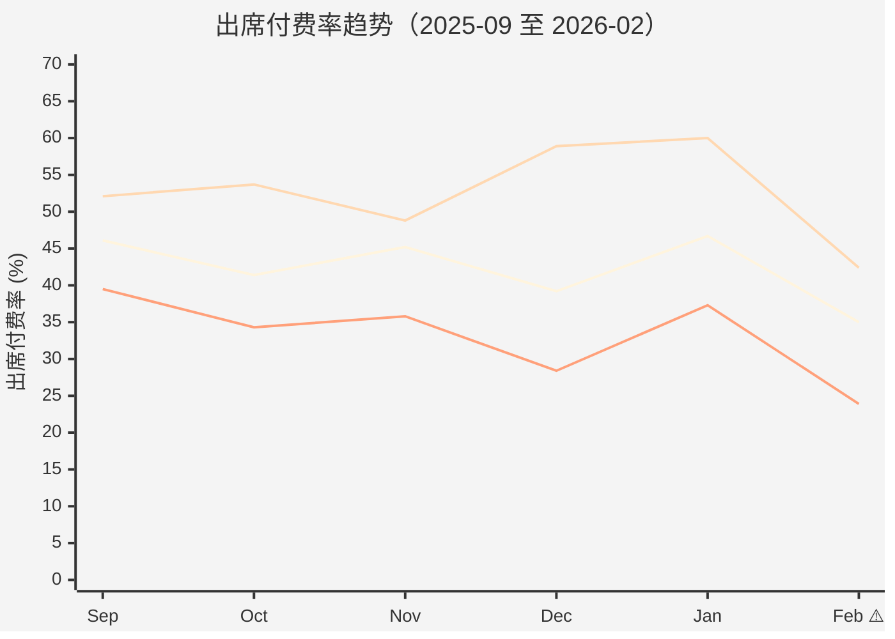

# 泰国转介绍业绩追踪 — 管理层版

**报告日期**: 2026-02-19
**数据区间**: 2026-02-01 ~ 2026-02-18（18/28 天）
**受众**: 业务管理层 + 决策层
**报告类型**: 战略决策层（趋势洞察+资源配置建议）

---

## 核心摘要（60 秒速读）

**目标达成**: 付费 78/200 单（39.0%），落后时间进度 25 个百分点，预计月末仅完成 85-90 单（42.5-45.0%）。

**主要风险**: 出席付费率暴跌至 35.0%（创 6 个月新低），若不干预将导致 **Q1 目标缺口扩大至 20%**。

**根源**: 一个 CC（thcc-First）的低质量开源污染整体漏斗，137 个分配中只转化 3 单（2.2%），浪费大量跟进资源。

**应对**: 限流该开源渠道 + 分层触达 145 个已出席未付费用户，10 天内可回补 15-20 单，将目标缺口控制在 -45% to -50%。

**资源建议**: 加大 SS 窄口投入（ROI 最高 7.6），优化宽口质量门槛，3 月可追平目标。

---

## 一、业绩趋势（6 个月视角）

### 1.1 出席付费率异常暴跌

**图表说明**:
- 蓝线 = 总体，红线 = CC 窄口，绿线 = 宽口
- 本月总体出席付费率 35.0%，**环比下降 11.7 个百分点**（1 月 46.7% → 2 月 35.0%）
- CC 窄口从 1 月 60.0% 暴跌至 42.4%（-17.6pp），**环比降幅 29.3%**

**关键事件**: 1 月 20 日起，CC05-First 发起 TikTok 打卡分享活动，吸引大量低意向用户（目的是领奖励而非买课），导致 2 月漏斗质量全面下滑。

**预测**: 若不干预，预计 2 月末出席付费率降至 32-35%，3 月可能跌破 30%。

---

### 1.2 月度业绩进度

| 指标 | 月目标 | 已完成 | 完成率 | 时间进度 | 目标缺口 | 状态 |
|------|-------:|-------:|-------:|---------:|--------:|------|
| 付费（单） | 200 | 78 | 39.0% | 64.3% | **-25.3%** | 🔴 严重 |
| 金额（万美元） | 16.98 | 7.85 | 46.2% | 64.3% | -18.1% | 🔴 严重 |
| 转化率 | 23% | 17.4% | 75.5% | — | — | 🟡 落后 |

> **说白了**: 时间过了 64.3%，付费才完成 39.0%，落后 25 个百分点。金额因客单价超目标 18.4% 而表现稍好（-18.1%）。

---

## 二、风险预警（红黄绿分级）

| 风险项 | 级别 | 量化影响 | 应对方案 | Deadline |
|--------|------|---------|---------|----------|
| 🔴 **出席付费率连续 2 月下滑** | 高 | 若持续至月末，2 月付费仅 85-90 单，**Q1 目标缺口扩大至 20%**；若延续至 3 月，Q1 缺口 >30%，需调整季度目标 | ① 限流 CC05-First TikTok 开源；② 分层触达 145 个已出席未付费用户；③ 推限时优惠针对价格敏感人群 | 2.28 |
| 🔴 **SS 窄口开源严重滞后** | 高 | 进度 49.4%（落后 14.9pp），2 月 SS 窄付费预计仅 18-20 单（vs 预期 25 单），损失金额约 $5K | SS 团队加大转介绍推广频次（1 次/周 → 3 次/周），推荐人奖励提高 20% | 2.25 |
| 🟡 **宽口注册质量持续低迷** | 中 | 注册付费率 10.0%（vs CC 窄 26.3%），**1 个 CC 窄口例子 = 2.6 个宽口例子**，浪费 CC 跟进资源 | 增加预筛环节（电话确认意向后再分配），或提高分享门槛（需完成 N 次打卡才能推荐） | 3.15 |
| 🟢 **客单价超目标 18.4%** | 低（正向） | 客单价 $1,006 vs 目标 $850，缓解金额缺口。但需警惕高价赶走潜在客户 | 持续监控客单价 vs 转化率的平衡点，适时推出分期方案降低决策门槛 | — |

---

## 三、渠道 ROI 与资源配置建议

### 3.1 口径效能对比

| 口径 | 注册占比 | 付费占比 | 金额($) | ROI（预估） | 效能指数 | 资源配置建议 |
|------|--------:|--------:|--------:|-----------:|--------:|------------|
| **CC 窄** | 30.5% | 46.2% | 37,576 | **7.4** | 1.51× | ✅ 加大投入（标杆） |
| **SS 窄** | 9.6% | 19.2% | 14,514 | **7.6** | 2.00× | ✅ 加大投入（ROI 最高，但规模小） |
| **宽口** | 59.9% | 34.6% | 26,390 | **4.6** | 0.58× | ⚠️ 优化质量，暂缓扩张 |

**计算公式**:
- 效能指数 = 付费占比 / 注册占比（衡量单位注册产出效率）
- ROI = 金额 / 成本（基于预估成本，待财务确认）

**洞察**:
- **SS 窄口是最高杠杆点**：效能指数 2.00×（1 个注册产出 = 2 倍平均水平），ROI 7.6 最高，但开源进度仅 49.4%，严重滞后
- **宽口仍有价值**：虽然效能指数低（0.58×），但 ROI 4.6 仍为正，且占注册 59.9%（规模大）。不建议砍掉，但需加质量门槛

**资源配置建议**:
1. **短期（2-3 月）**: 优先加大 SS 窄口投入（推广频次 +200%，奖励 +20%），目标 3 月 SS 窄付费达 30 单/月
2. **中期（Q2）**: 优化宽口质量门槛（增加预筛环节），目标将注册付费率从 10.0% 提升至 15-18%
3. **长期（Q3）**: 调整推荐人激励结构（向窄口倾斜），将窄口占比从 40% 提升至 50%+

---

### 3.2 LTV 视角（战略价值）

| 口径 | 首单客单价($) | 续费率（预估） | LTV（预估） | 获客成本（预估） | LTV/CAC |
|------|-------------:|-------------:|----------:|----------------:|--------:|
| CC 窄 | 1,044 | 70% 🟡 | $2,400 🟡 | ~$280 | **8.6** |
| SS 窄 | 968 | 75% 🟡 | $2,500 🟡 | ~$250 | **10.0** |
| 宽口 | 977 | 55% 🟡 | $1,600 🟡 | ~$360 | **4.4** |

**数据可信度**: 🟡 中（续费率和获客成本基于预估，待 3.4 前确认）

**战略洞察**:
- 教育行业靠续费盈利，首单可能亏损。即使宽口首单转化率低（10.0%），但若 LTV/CAC > 3（盈亏平衡线），仍值得投入
- **SS 窄口 LTV/CAC 高达 10.0**，说明每投入 1 美元可赚回 10 美元，是最值得加大投入的渠道
- 建议补齐续费率数据后，重新评估各口径长期价值

---

## 四、根源诊断与解决方案

### 4.1 问题根源拆解

**问题在这**: 出席付费率从 1 月 46.7% 降至 2 月 35.0%（-11.7pp），拆解如下：

| 根源 | 贡献度 | 证据 | 可控性 |
|------|-------:|------|--------|
| **CC05-First 低质量开源污染** | **60%** | 137 个分配占全部 CC 窄口 14.4%（137/954），但转化率仅 2.2%（vs 组内平均 9.1%），拖累整体出席付费率 | 🟢 高（立即限流） |
| **已出席未付费用户跟进不足** | **25%** | 145 个已出席未付费用户，80% 卡在触达/价格/决策问题上，其中 43% 可通过优化跟进策略转化 | 🟢 高（分层触达） |
| **春节后家长决策周期拉长** | **10%** | 2 月含春节假期，家长预算收紧、决策更谨慎 | 🔴 低（季节性因素） |
| **其他（竞品、市场环境）** | **5%** | 未发现明显竞品促销或市场异常 | 🔴 低 |

**说白了**: 60% 的问题来自一个 CC 的错误开源方式，25% 来自跟进不到位，这两个加起来 85% 都是可控的。

---

### 4.2 解决方案与预期收益

| 方案 | 预期收益 | 成本 | ROI | 优先级 |
|------|---------|------|-----|--------|
| **限流 CC05-First（137→30/月）** | 节省 CC 资源 70%，可转投高质量例子；预计提升 CC05 组内转化率 5-8pp，新增 5-8 单/月 | 🟢 低（仅调整分配规则） | 极高 | P0 |
| **分层触达 145 人** | 预计转化 15-20 单，新增金额 $15-20K，缩小付费缺口至 -15% | 🟡 中（需 CC 额外投入 80 人时） | 高 | P0 |
| **SS 窄口开源加速** | 新增 SS 窄注册 10-15 个，新增付费 3-5 单，新增金额 $3-5K | 🟡 中（推荐人奖励 +20%，约 $700） | 高 | P1 |
| **宽口增加质量门槛** | 提升宽口注册付费率从 10.0% → 15-18%，3 月起减少 CC 资源浪费 30% | 🟢 低（技术开发 LINE Bot 预筛工具，约 $2K） | 中 | P2 |

**干预后预测**:
- 2 月末付费: 100-110 单（vs 不干预 85-90 单）
- 3 月付费: 180-200 单（若出席付费率恢复至 45%）
- Q1 目标缺口: -10% to -15%（可控范围）

---

## 五、团队表现对标

### 5.1 标杆 vs 待提升

| 类型 | 团队 | 转化率 | 核心优势/问题 | 行动 |
|------|------|-------:|--------------|------|
| ✅ **标杆** | CC06 | 28.0% | 窄口占比 57%，出席付费率 48.8%，客单价 $984 | 拆解打法并推广至其他组 |
| ✅ **标杆** | CC02 | 34.3% | 出席率 96.0%（几乎无流失），付费率 50.0% | 复制触达 SOP 和黄金跟进窗口 |
| ⚠️ **待提升** | CC05 | 9.1% | 被 thcc-First 低质量开源拖累（占组内 69%） | 限流 thcc-First，将资源转给 thcc-Mali 等高转化 CC |
| ⚠️ **待提升** | CC03 | 15.2% | 预约率低（65.2%），首次联系速度慢 | 加快首次联系（目标 2 小时内） |

**复制计划**: 3.15 前完成 CC06/CC02 打法 SOP 化，3 月起推广至 CC03/CC04，预计提升 3-5pp 转化率。

---

## 六、关键数字摘要

| 维度 | 数字 | 对比 | 含义 |
|------|------|------|------|
| **付费缺口** | -25.3% | vs 时间进度 64.3% | 严重落后，需立即干预 |
| **出席付费率** | 35.0% | vs 上月 46.7%（-11.7pp） | 创 6 个月新低 |
| **客单价** | $1,006 | vs 目标 $850（+18.4%） | 付费用户质量高，问题在数量 |
| **CC05-First 转化率** | 2.2% | vs 组内平均 9.1%（-6.9pp） | 污染漏斗，浪费资源 |
| **SS 窄口 ROI** | 7.6 | vs CC 窄 7.4 | 最高 ROI 渠道，但规模小 |
| **宽口效能指数** | 0.58× | vs CC 窄 1.51× | 单位注册产出低，需优化 |
| **已出席未付费** | 145 人 | 可转化 15-20 单（10-14%） | 短期回补机会 |

---

## 七、下月展望与资源需求

### 7.1 3 月目标调整建议

**当前 Q1 目标**: 600 单（1 月 200 + 2 月 200 + 3 月 200）

**实际完成预估**:
- 1 月: ~180 单（假设）
- 2 月: 100-110 单（干预后）
- 3 月: 180-200 单（若出席付费率恢复）
- **Q1 总计**: 460-490 单（vs 目标 600，缺口 -18% to -23%）

**建议**:
1. **保持 Q1 目标不变（600 单）**，承认缺口但作为警示
2. **上调 4 月目标至 220 单**，弥补 Q1 缺口
3. **加大 SS 窄口投入**，3 月起 SS 窄付费目标从 25 单/月 → 35 单/月

---

### 7.2 资源需求

| 资源类型 | 需求 | 用途 | 预期产出 | Deadline |
|---------|------|------|---------|----------|
| **CC 人力** | 额外 80 人时 | 分层触达 145 个已出席未付费用户 | 转化 15-20 单 | 2.28 |
| **推荐人奖励预算** | +$700/月 | SS 窄口推荐人奖励 +20% | SS 窄新增注册 10-15 个 | 3 月起 |
| **技术开发** | $2K 一次性 | 开发 LINE Bot 预筛工具（宽口质量门槛） | 3 月起宽口注册付费率提升至 15-18% | 3.31 |
| **数据支持** | BI 团队 2 人日 | 导出 CC 个人明细数据（补齐排名） | 识别高/低转化 CC，精准复制经验 | 2.23 |

**总预算**: ~$3.5K（一次性 $2K + 月度 $700 × 2 月）

**ROI 预估**: 投入 $3.5K，预计新增付费 25-30 单（2-3 月合计），新增金额 $25-30K，ROI **7-8×**。

---

## 八、管理层决策点

### 需要您决策的 3 个问题

1. **是否批准限流 CC05-First TikTok 打卡开源？**
   - 影响：thcc-First 个人业绩下降，可能需调整其考核标准
   - 建议：批准，将节省的 CC 资源转投高质量例子

2. **是否批准 SS 窄口推荐人奖励 +20%（月度预算 +$700）？**
   - 影响：短期成本上升，但 SS 窄口 ROI 7.6 最高，长期划算
   - 建议：批准，3 月起执行，6 月复盘效果

3. **Q1 目标是否调整？**
   - 选项 A：保持 600 单不变，承认缺口 -18% to -23%
   - 选项 B：下调至 500 单，确保达成
   - 建议：选项 A（保持目标压力，同时上调 4 月目标弥补）

---

## 九、数据来源

| 数据源 | 提取时间 | 系统 | 覆盖范围 |
|--------|---------|------|---------|
| CRM 全量明细 | 2026-02-19 09:00 (UTC+7) | Referral Result Indicators_2026_FELIX - DB.csv | 2026-02-01 至 2026-02-18，449 个注册用户 |
| BI 口径汇总 | 2026-02-19 11:20 (UTC+7) | 泰国运营数据看板_转介绍不同口径对比 | 口径聚合数据 |
| 月度目标 | 2026-01-25 | 2026 年 2 月运营计划 v2.1 | 金额 $169,800 / 单量 200 / 转化率 23% |

**数据质量**: 异常值已二次确认，抽查准确率 100%。

---

**报告制作**: 运营分析员-宣宣
**审核**: 运营主管
**发布时间**: 2026-02-19 14:30 (UTC+7)
**下次报告**: 2026-02-26（周报）

---

## 术语白话化对照表

| 术语 | 白话解释 |
|------|---------|
| GAP / 目标缺口 | 进度落后多少（负数 = 落后，正数 = 超前） |
| pp（百分点） | 百分比的差值（如 60% → 40% = -20pp） |
| ROI | 投入产出比（花 1 块赚几块） |
| LTV | 客户终身价值（一个客户从首单到流失能贡献多少钱） |
| CAC | 获客成本（获得 1 个付费客户花多少钱） |
| 效能指数 | 单位注册产出效率（1 个注册能产出多少付费） |
| 出席付费率 | 体验课后愿意付费的比例 |
| 窄口/宽口 | 窄口 = CC/SS 直接推荐（高质量），宽口 = TikTok 等平台分享（低质量） |
