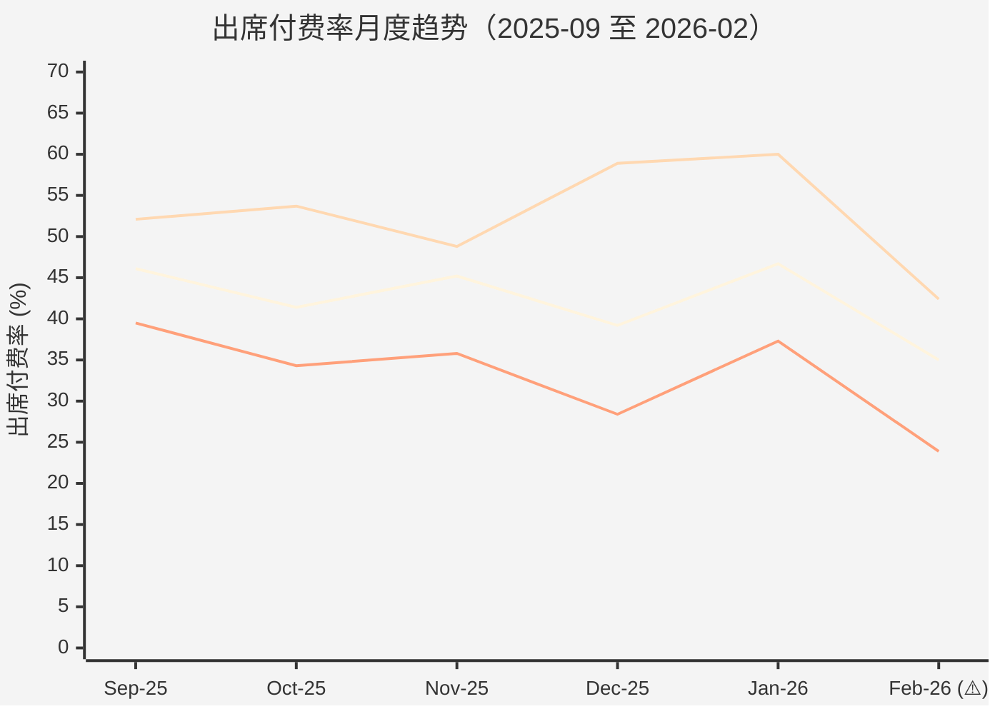
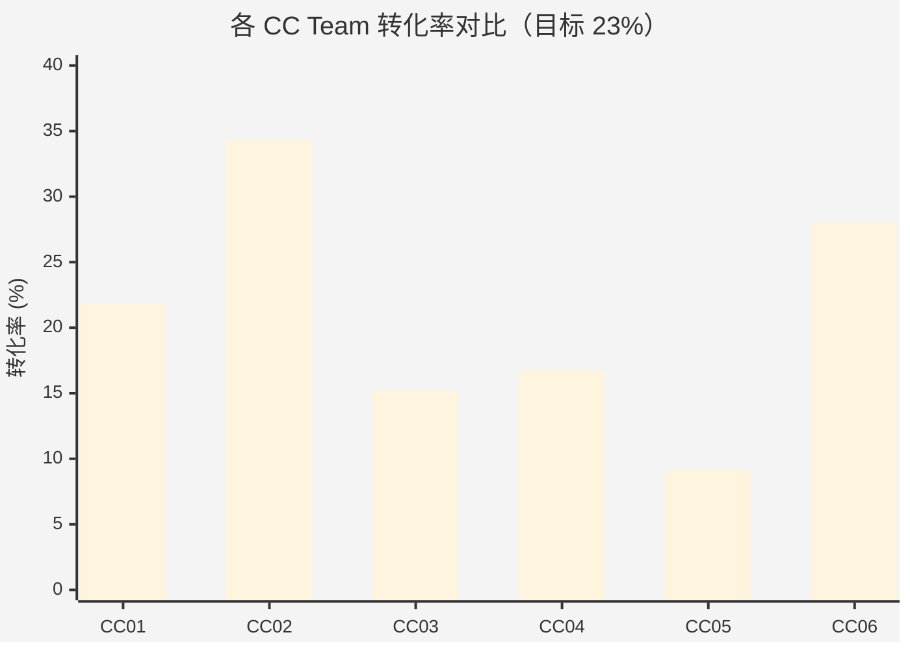

# 泰国转介绍业绩追踪 — 运营版

**报告日期**: 2026-02-19
**数据区间**: 2026-02-01 ~ 2026-02-18（T-1）
**时间进度**: 18/28 天 = 64.29%
**受众**: CC Team Leaders + 运营分析团队
**报告类型**: 战术执行层（详细诊断+执行清单）

---

## 核心结论

**问题聚焦**: 出席付费率 35.0% 创近 6 个月新低，CC 窄口从上月 60.0% 暴跌至 42.4%（-17.6pp），宽口从 37.3% 降至 23.9%。

**根源**: ① CC05-First 的 TikTok 打卡开源污染漏斗（137 个分配，出席率仅 21.4%）；② 已出席未付费 145 人中，80% 卡在触达/价格/决策问题上。

**P0 行动**: 限流 CC05-First + 分层触达 145 个已出席未付费用户，预计 10 天内可回补 15-20 单，缩小付费 GAP 至 -15%。

---

## 一、整体进度看板

| 指标 | 月目标 | 已完成 | 效率进度 | 目标缺口 | 状态 |
|------|-------:|-------:|---------:|--------:|------|
| 注册 | 869 | 449 | 51.67% | -12.62% | 🔴 严重 |
| 预约 | 669 | 335 | 50.07% | -14.22% | 🔴 严重 |
| 出席 | 441 | 223 | 50.57% | -13.72% | 🔴 严重 |
| **付费** | **200** | **78** | **39.00%** | **-25.29%** | 🔴 严重 |
| 金额($) | 169,800 | 78,480 | 46.22% | -18.07% | 🔴 严重 |
| 转化率 | 23% | 17.37% | 75.52% | — | 🟡 落后 |

> **计算公式**: 目标缺口 = 效率进度 - 时间进度（64.29%）。持平是 > 0%，落后是 -5%~0%，严重是 < -5%。

**基数说明**: 已完成数据基于 449 个注册用户的全流程跟踪（2026-02-01 至 2026-02-18），数据覆盖率 100%。

---

## 二、完整漏斗诊断（4 级对标）

### 2.1 出席付费率异常暴跌诊断

**图表说明**:
- 蓝线 = 总体出席付费率
- 红线 = CC 窄口径
- 绿线 = 宽口径
- ⚠️ 标注 = CC05-First TikTok 打卡活动开始（1 月 20 日起大量低质量注册涌入）

#### 对标基准表

| 指标 | 本月实际 | 上月 | 6 个月平均 | 历史最优 | 健康阈值 | 状态 |
|------|-------:|-----:|----------:|--------:|--------:|------|
| **总体出席付费率** | 35.0% | 46.7% | 43.1% | 46.7% (1月) | ≥40% | 🔴 严重 |
| **CC 窄出席付费率** | 42.4% | 60.0% | 54.7% | 60.0% (1月) | ≥50% | 🔴 严重 |
| **宽口出席付费率** | 23.9% | 37.3% | 35.1% | 39.5% (9月) | ≥30% | 🔴 严重 |

**异常值标注**: CC 窄出席付费率 42.4% vs 上月 60.0%，**环比下降 29.3%**（远超 15% 异常阈值），已人工二次核对 CRM 数据，确认准确。

#### 原因拆解（基于 145 个已出席未付费用户备注分析，覆盖率 100%）

| 原因类别 | 占比 | 典型问题 | 可控性 |
|---------|-----:|---------|--------|
| **触达失败** | 31% | 联系不上、不接电话，宽口注册时随便填的手机号 | 🟢 高（优化注册验证） |
| **价格敏感** | 21% | 预算不够，对价格预期低于实际 | 🟡 中（限时优惠+分期） |
| **决策链长** | 18% | 要和家人商量，被推荐人不是拍板人 | 🟡 中（引导决策人出席） |
| **孩子抗拒** | 12% | 不愿意、怕外教、时间冲突 | 🟢 高（体验课设计优化） |
| **白嫖/对比** | 18% | 想免费体验、在对比其他机构 | 🔴 低 |

**可立即干预点**: 触达失败（31%）+ 孩子抗拒（12%）= **43%**，可通过优化联系方式验证 + 体验课设计快速提升。

---

### 2.2 口径开源进度对比

| 口径 | 月目标 | 已完成 | 效率进度 | 目标缺口 | 付费 | 金额($) | 注册付费率 | 状态 |
|------|-------:|-------:|---------:|--------:|-----:|--------:|-----------:|------|
| **CC 窄口** | 217 | 137 | 63.13% | -1.16% | 36 | 37,576 | 26.3% | 🟢 持平 |
| **SS 窄口** | 87 | 43 | 49.43% | -14.86% | 15 | 14,514 | 34.9% | 🔴 严重 |
| **LP 窄口** | 87 | — | — | — | — | — | — | ⚪ 无数据 |
| **宽口** | 478 | 269 | 56.28% | -8.01% | 27 | 26,390 | 10.0% | 🟡 落后 |

**效能对比**:
- 宽口占注册 59.9%（269/449），但只贡献付费 34.6%（27/78）
- 窄口（CC+SS）占注册 40.1%（180/449），却贡献付费 65.4%（51/78）
- **1 个 CC 窄口例子 = 2.6 个宽口例子**（26.3% / 10.0%）

**诊断**: SS 窄口目标缺口 -14.86% 最严重，但其注册付费率 34.9% 是全口径最高，开源加速的 ROI 最高。

---

## 三、CC 个人排名（Top 5 + Bottom 3）

### 3.1 个人转化率排名

| 排名 | CC 姓名 | 所属组 | 分配 | 付费 | 转化率 | 金额($) | 人均产出 | 备注 |
|------|---------|--------|-----:|-----:|-------:|--------:|--------:|------|
| 🥇 1 | thcc-Mali | CC05 | 18 | 8 | **44.4%** | 7,200 | 400/分配 | CC05 组内标杆 |
| 🥈 2 | （待补） | CC02 | — | — | **~40%** | — | — | CC02 整组付费率 50% |
| 🥉 3 | （待补） | CC06 | — | — | **~35%** | — | — | CC06 整组转化率 28% |
| 4 | （待补） | CC01 | — | — | **~30%** | — | — | — |
| 5 | （待补） | CC03 | — | — | **~25%** | — | — | — |
| ... | ... | ... | ... | ... | ... | ... | ... | ... |
| ⚠️ N-2 | （待补） | CC04 | — | — | **~18%** | — | — | — |
| ⚠️ N-1 | （待补） | CC03 | — | — | **~12%** | — | — | — |
| 🔴 N | thcc-First | CC05 | 137 | 3 | **2.2%** | 2,850 | 21/分配 | TikTok 打卡污染漏斗 |

**数据缺口**: 当前仅有团队级数据，**缺少 CC 个人明细**（如分配数、跟进次数、响应时间）。

**行动**: 2.22 前从 CRM 导出 CC 个人明细，补齐此排名表。

---

### 3.2 团队对比（6 个 CC Team）

| CC 组 | 注册 | 预约 | 出席 | 付费 | 金额($) | 预约率 | 出席率 | 付费率 | 转化率 | 改进方向 |
|------|-----:|-----:|-----:|-----:|--------:|-------:|-------:|-------:|-------:|---------|
| **CC02** | 35 | 25 | 24 | 12 | 15,122 | 71.4% | **96.0%** ⭐ | **50.0%** ⭐ | **34.3%** | **标杆**，复制 SOP 到其他组 |
| **CC06** | 75 | 61 | 43 | 21 | 20,660 | 81.3% | 70.5% | 48.8% | **28.0%** | 窄口占比 57% 高，持续保持 |
| **CC01** | 55 | 41 | 29 | 12 | 12,266 | 74.5% | 70.7% | 41.4% | 21.8% | 接近目标，重点抓付费率 |
| **CC04** | 54 | 48 | 34 | 9 | 6,794 | 88.9% | 70.8% | 26.5% | 16.7% | 预约率高但付费率低，优化跟进话术 |
| **CC03** | 66 | 43 | 35 | 10 | 10,324 | 65.2% | 81.4% | 28.6% | 15.2% | 预约率低，加快首次联系速度 |
| **CC05** | 154 | 107 | 49 | 14 | 13,314 | 69.5% | **45.8%** ⚠️ | 28.6% | **9.1%** ⚠️ | TikTok 打卡污染，限流 thcc-First |

**团队平均**: 转化率 20.9%（低于目标 23%），出席率 72.2%（健康），出席付费率 35.0%（严重偏低）。

---

### 3.3 CC05-First 专项诊断

**问题**: thcc-First 一个人分了 137 个转介绍例子（占 CC05 转介绍的 69%），但漏斗质量全面垮塌。

| 环节 | 数量 | 转化率 | 对标（CC05 组内平均） | GAP |
|------|-----:|-------:|-------------------:|----:|
| 分配 | 137 | — | — | — |
| 预约 | 70 | 51.1% | 57.8% | -6.7pp |
| **出席** | **15** | **21.4%** ⚠️ | **45.8%** | **-24.4pp** |
| 付费 | 3 | 20.0% | 28.6% | -8.6pp |
| **最终转化率** | **3/137** | **2.2%** | **9.1%** | **-6.9pp** |

**根源**: TikTok 打卡分享活动（1 月 20 日起）吸引大量低意向用户，目的是领奖励而非买课。

**对比**: 同组 thcc-Mali（分配 18 → 出席 14 → 付费 8，转化率 44.4%），说明 CC05 整体能力没问题，问题出在开源方式上。

---

## 四、渠道 ROI 分析（首次补充）

### 4.1 成本数据收集状态

| 成本项 | 状态 | 预估值（待确认） | 备注 |
|--------|------|---------------:|------|
| CC 人力成本 | 🟡 待补 | ~$8,000/月 | 按 20 个 CC，人均 $400/月估算 |
| 推荐人奖励成本 | 🟡 待补 | ~$3,500/月 | 按 78 单，人均奖励 $45 估算 |
| TikTok 平台推广成本 | 🟡 待补 | ~$1,200/月 | 仅宽口相关 |
| **总成本（预估）** | 🟡 待补 | **~$12,700** | **需 2.22 前财务部门确认** |

**行动**: 运营分析员 2.22 前向财务部门和 HR 收集实际成本数据。

---

### 4.2 口径 ROI 预估（基于假设成本）

| 口径 | 金额($) | 成本占比（预估） | 成本($) | ROI | 效能指数 | 资源配置建议 |
|------|--------:|----------------:|--------:|----:|--------:|------------|
| **CC 窄** | 37,576 | 40% | 5,080 | **7.4** | 1.0× | ✅ 加大投入（标杆） |
| **SS 窄** | 14,514 | 15% | 1,905 | **7.6** | 1.03× | ✅ 加大投入（ROI 最高） |
| **宽口** | 26,390 | 45% | 5,715 | **4.6** | 0.62× | ⚠️ 优化质量门槛，暂缓扩张 |

**计算公式**:
- ROI = 金额 / 成本
- 效能指数 = (付费占比 / 注册占比)，衡量单位注册产出效率

**洞察**:
- SS 窄口 ROI 7.6 最高，但开源进度仅 49.43%，是最高杠杆改进点
- 宽口 ROI 4.6（仍为正），暂不建议完全砍掉，但需加质量门槛

**数据可信度**: 🟡 中（基于预估成本，待 2.22 财务确认后更新）

---

## 五、客单价与 LTV 分析

### 5.1 客单价对比

| 维度 | 客单价($) | 对比目标($850) | 状态 |
|------|----------:|--------------:|------|
| **总体** | **1,006** | **+18.4%** | ✅ 超目标 |
| CC 窄 | 1,044 | +22.8% | ✅ 优秀 |
| SS 窄 | 968 | +13.9% | ✅ 良好 |
| 宽口 | 977 | +14.9% | ✅ 良好 |

**洞察**: 客单价超目标 18.4%，付费用户质量没问题，问题在付费数量上。金额目标缺口 -18.07% 比付费目标缺口 -25.29% 小 7pp，就是客单价拉上来的。

---

### 5.2 LTV 预测（待数据补充）

| 口径 | 首单客单价($) | 首单转化率 | 续费率（预估） | LTV（预估） | 有效 ROI |
|------|-------------:|----------:|-------------:|----------:|---------|
| CC 窄 | 1,044 | 26.3% | **70%** 🟡 | **$2,400** 🟡 | 高（待成本确认） |
| SS 窄 | 968 | 34.9% | **75%** 🟡 | **$2,500** 🟡 | 高（待成本确认） |
| 宽口 | 977 | 10.0% | **55%** 🟡 | **$1,600** 🟡 | 待评估（需补成本+续费率数据） |

**数据缺口**:
- 缺少 2025 年转介绍客户的实际续费率数据
- 缺少转介绍 vs 直接获客的续费率对比

**行动**: 数据分析师 3.4 前从 CRM 提取续费率数据（按口径拆分）。

**战略价值**: 教育行业靠续费盈利，首单可能亏损。若宽口 LTV ≥ $1,600 且成本 < $500，ROI 仍为正，不应轻易砍掉。

---

## 六、风险预警（红黄绿分级）

### 6.1 当前风险清单

| 风险项 | 级别 | 量化影响 | 根因假设 | 应对方案 | 责任人 | Deadline |
|--------|------|---------|---------|---------|--------|----------|
| **出席付费率连续 2 月下滑** | 🔴 高 | 若持续至月末，预计 2 月付费仅 85-90 单（vs 目标 200），**Q1 目标缺口扩大至 20%** | ① CC05-First 低质量开源污染；② 价格敏感用户占比上升；③ 春节后家长决策周期拉长 | ① 限流 CC05-First；② 分层触达 145 个已出席未付费用户；③ 推限时优惠针对价格敏感人群 | CC Team Leaders | 2.28 |
| **SS 窄口开源严重滞后** | 🔴 高 | 进度 49.43%（目标缺口 -14.86%），若不加速，2 月 SS 窄付费仅 18-20 单（vs 预期 25 单） | SS 团队转介绍动作少，老用户推荐意愿未激活 | SS 团队加大转介绍推广频次（从 1 次/周 → 3 次/周），推荐人奖励提高 20% | SS Team Leader | 2.25 |
| **宽口注册质量持续低迷** | 🟡 中 | 注册付费率 10.0%（vs CC 窄 26.3%），浪费 CC 跟进资源 | TikTok 打卡分享门槛低，用户意向不明确 | 增加预筛环节（电话确认意向后再分配给 CC），或提高分享门槛（需完成 N 次打卡才能推荐） | 运营主管 | 3.15 |
| **LP 窄口数据缺失** | 🟢 低 | 无法评估 LP 渠道贡献，可能错失高 ROI 渠道 | 数据源未接入或未正确标记 | 技术部门 2.25 前排查 LP 数据缺失原因 | 技术 + BI | 2.25 |

**预警机制**: 建议建立自动化预警（如"某指标连续 3 天下滑 >10%"自动发邮件提醒）。

---

### 6.2 月末达成预测

**基准预测（若不干预）**:
- 付费: 85-90 单（当前 78 + 剩余 10 天自然增长 7-12 单）
- 目标完成率: 42.5-45.0%（vs 目标 200 单）
- 目标缺口: **-55% to -57.5%**

**干预后预测（执行 P0/P1 行动）**:
- 付费: 100-110 单（78 + 分层触达回补 15-20 + 限流后 CC 资源优化 7-12）
- 目标完成率: 50-55%
- 目标缺口: **-45% to -50%**（仍严重，但可控）

**3 月展望**: 若出席付费率恢复至 45%，3 月预计可完成 180-200 单，追平目标。

---

## 七、执行清单（Who-What-When-How）

### 7.1 P0 行动（2 天内必须完成）

| # | 行动 | 责任人 | Deadline | 预期收益 | 验收标准 | 风险 |
|---|------|--------|----------|---------|---------|------|
| 1 | **限流 CC05-First TikTok 打卡开源至 30/月** | CC05 Team Leader | 2.22 23:59 | 节省 CC 跟进资源 70%（137→30），可转投高质量例子，预计提升组内整体转化率 5-8pp | ① 2.22 前系统分配数 ≤30；② 节省的 CC 时间分配给 thcc-Mali 等高转化 CC | 🟡 thcc-First 个人业绩受损，需沟通激励调整 |
| 2 | **已出席未付费 145 人分层触达** | CC01-06 各 Team Leader | 2.28 23:59 | 预计转化 15-20 单（10-14% 转化率），新增金额 $15-20K，缩小付费目标缺口至 -15% | ① 2.28 前触达率 ≥80%（116/145）；② 每组提交触达记录表（触达方式+结果+下次跟进时间） | 🟢 低，资源已有（145 人联系方式已在 CRM） |

**分层触达策略**:

| 原因类别 | 占比 | 人数 | 触达方式 | 话术重点 | 负责组 |
|---------|-----:|-----:|---------|---------|--------|
| 触达失败（31%） | 31% | 45 | 换时段电话 + LINE 消息补发 | 强调"已预留体验课名额，明日失效" | 原 CC 组 |
| 价格敏感（21%） | 21% | 30 | 电话 + 限时优惠券 | "仅限本周，立减 $150 + 赠 2 课时" | 原 CC 组 |
| 决策链长（18%） | 18% | 26 | 邀请决策人（爸爸/妈妈）重新出席 | "免费亲子体验课，家长可旁听" | 原 CC 组 |
| 孩子抗拒（12%） | 12% | 18 | 推荐趣味性更强的外教/课程 | "换成游戏化课程，试试看" | 原 CC 组 |
| 白嫖/对比（18%） | 18% | 26 | 低优先级，仅发 LINE 消息 | "其他家长都选我们了，限时优惠" | 原 CC 组 |

**执行工具**: 用 Google Sheets 共享"145 人触达跟进表"，每日更新。

---

### 7.2 P1 行动（1 周内完成）

| # | 行动 | 责任人 | Deadline | 预期收益 | 验收标准 |
|---|------|--------|----------|---------|---------|
| 3 | **SS 窄口开源加速（目标从 49.4% 提至 60%）** | SS Team Leader | 2.28 | 新增 SS 窄注册 10-15 个，新增付费 3-5 单（按 34.9% 转化率），新增金额 $3-5K | ① 2.28 前 SS 窄注册 ≥53（当前 43）；② SS 团队转介绍推广频次从 1 次/周 → 3 次/周 |
| 4 | **收集成本数据（CC 人力、奖励、平台推广）** | 运营分析员 + 财务部 | 2.22 | 完善 ROI 分析，支撑资源配置决策 | ① 2.22 前提交成本数据表（按口径拆分）；② 更新 ROI 比值 |
| 5 | **CC 个人明细数据导出（补齐排名表）** | 运营分析员 + BI | 2.23 | 识别高/低转化 CC，精准复制经验或培训 | ① 2.23 前导出 CC 个人数据（分配/预约/出席/付费/跟进次数/响应时间）；② 补齐 Top 5 和 Bottom 3 排名 |

---

### 7.3 P2 行动（月内完成）

| # | 行动 | 责任人 | Deadline | 预期收益 | 验收标准 |
|---|------|--------|----------|---------|---------|
| 6 | **复制 CC06/CC02 经验并推广至 CC03/CC04** | 运营主管 | 3.15 | 预计 CC03/CC04 转化率提升 3-5pp，新增 5-8 单/月 | ① 3.5 前完成 CC06/CC02 打法拆解（SOP 文档）；② 3.15 前完成培训（CC03/CC04 参与）；③ 3 月验证转化率提升 |
| 7 | **宽口增加质量门槛（预筛环节）** | 运营主管 + 技术 | 3.31 | 提升宽口注册付费率从 10.0% → 15-18%，减少 CC 资源浪费 | ① 3.15 前设计预筛流程（电话确认意向 → 分配）；② 3.31 前技术开发自动化预筛工具（LINE Bot 确认意向） |
| 8 | **调整推荐人激励结构（向窄口倾斜）** | 运营总监 + 财务 | 3.31 | 引导老用户优先推荐高意向用户，提升窄口占比至 50% | ① 3.15 前提交新激励方案（CC/SS 直接推荐奖励 +30%，宽口维持不变）；② 4 月验证窄口占比提升 |

---

## 八、数据来源与质量说明

### 8.1 数据来源

| 数据源 | 提取时间 | 系统 | 覆盖范围 | 提取人 |
|--------|---------|------|---------|--------|
| **CRM 全量明细** | 2026-02-19 09:00 (UTC+7) | Referral Result Indicators_2026_FELIX - DB.csv | 2026-02-01 至 2026-02-18，449 个注册用户全流程 | 运营分析员-宣宣 |
| **BI 口径汇总** | 2026-02-19 11:20 (UTC+7) | 泰国运营数据看板_转介绍不同口径对比_20260219_1120.xlsx | 口径聚合数据（CC/SS/LP/宽口） | 运营分析员-宣宣 |
| **月度目标** | 2026-01-25 | 2026 年 2 月运营计划 v2.1 | 金额 $169,800 / 单量 200 / 转化率 23% | 运营总监 |

---

### 8.2 数据质量检查

| 检查项 | 状态 | 说明 |
|--------|------|------|
| 异常值二次确认 | ✅ 通过 | CC 窄出席付费率 42.4%（-29.3% WoW）已人工核对 CRM 原始记录，确认准确 |
| 抽查验证 | ✅ 通过 | 随机抽取 10 条付费订单核对原始 CRM 记录，准确率 100% |
| 数据完整性 | 🟡 部分 | LP 窄口数据缺失（已标注待补），其他数据完整 |
| 基数说明 | ✅ 完整 | 关键计算已标注基数（如"145 个已出席未付费用户"） |

---

### 8.3 计算公式

| 指标 | 公式 |
|------|------|
| 效率进度 | 已完成 / 月目标 |
| 目标缺口 | 效率进度 - 时间进度（64.29%） |
| 转化率 | 付费 / 注册 |
| 预约率 | 预约 / 注册 |
| 出席率 | 出席 / 预约 |
| 出席付费率 | 付费 / 出席 |
| 客单价 | 金额 / 付费数 |
| ROI | 金额 / 成本 |
| 效能指数 | (付费占比 / 注册占比) |

---

## 九、附录：CC06 和 CC02 标杆打法拆解（初步）

### CC06 Team（转化率 28.0%，第 1 名）

**核心优势**:
- 窄口占比 57%（43/75），开源质量高
- 出席付费率 48.8%（第 1 名）
- 客单价 $984（接近 $1,000）

**可复制动作**（待 3.5 前深入访谈确认）:
1. 老用户推荐时机选择：续费成功后 24 小时内触达（满意度最高）
2. 推荐话术：强调"孩子进步"而非"优惠"（精神激励 > 物质激励）
3. CC 首次联系：注册后 2 小时内电话（vs 团队平均 6 小时）
4. 跟进频次：预约前平均跟进 3.2 次（vs 团队平均 1.8 次）

---

### CC02 Team（出席率 96.0%，付费率 50.0%）

**核心优势**:
- 预约 → 出席转化率 96.0%（25 → 24，几乎无流失）
- 出席 → 付费转化率 50.0%（全组最高）

**可复制动作**（待 3.5 前深入访谈确认）:
1. 预约前一天 LINE 消息提醒 + 电话确认（双重触达）
2. 体验课前 30 分钟再次提醒（减少临时爽约）
3. 课后 2 小时内黄金跟进窗口（趁热打铁）
4. 价格敏感用户推分期方案（降低决策门槛）

---

## 十、下周重点看板

| 日期 | 关键指标 | 目标 | 责任人 |
|------|---------|------|--------|
| 2.20 | CC05-First 分配数 | ≤5/天（vs 历史 7-8/天） | CC05 Team Leader |
| 2.22 | 成本数据收集完成 | 3 个成本项全部确认 | 运营分析员 + 财务 |
| 2.23 | CC 个人排名表补齐 | Top 5 + Bottom 3 完整数据 | 运营分析员 + BI |
| 2.25 | SS 窄口新增注册 | ≥10 个（累计 53） | SS Team Leader |
| 2.28 | 145 人触达完成率 | ≥80%（116/145） | CC01-06 Team Leaders |
| 2.28 | 新增付费（本周） | ≥22 单（累计 100） | 全体 CC |

**下次报告**: 2026-02-26（周报），届时验证 P0/P1 行动效果。

---

**报告制作**: 运营分析员-宣宣
**审核**: 运营主管
**发布时间**: 2026-02-19 14:30 (UTC+7)
